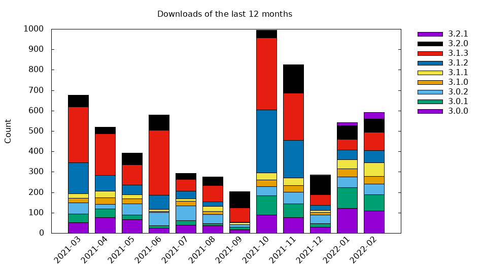
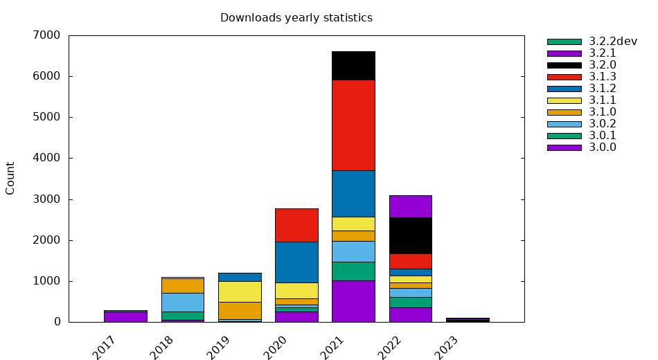

# GeoEasy
surveying calculation, network adjustment, digital terrain models, regression calculation

Volunteers are welcome! Send us bug reports, feature requests through the
issue tracker.  Clone the repository, change the code and send us back a pull
request to include your enhancement in the core system.

## History

The beginning of GeoEasy goes back to the late nineties (1997). Prior to version 3.0 
it was proprietary software marketed in Hungary. After twenty
year long development (with active and less active periods) in 2017 the license
was changed to open source.

## Documentation

See the [doc](./doc) folder for various reStructuredText files, the [wiki](https://github.com/zsiki/GeoEasy/wiki) and a paper in [Geoinformatics FCE CTU](https://ojs.cvut.cz/ojs/index.php/gi/article/view/gi.17.2.1/4642).

[Presentation](https://www.slideshare.net/ZoltanSiki/geoeasy-foss4g) at FOSS4G 2019 Bucharest and [video](https://media.ccc.de/v/bucharest-413-geoeasy-free-surveying-calculations)

[Developer documentation](http://digikom.hu/tcldoc/)

[OpenHub page](https://www.openhub.net/p/geoeasy)

## Installation

Installation binaries for latest stable version (3.2.1):

* [Debian/Ubuntu](http://digikom.hu/download/geoeasy_3.2.1.deb)
* [Windows](http://digikom.hu/download/Gizi321Setup.exe)
* [Windows portable (zip)](http://digikom.hu/download/GeoEasy321.zip)

Users can select source or [beta binary or older releases](http://digikom.hu/english/geo_easy_e.html). GNU/Linux, macOS and Windows operating
systems are supported. See the [installation guide](doc/install.rst).

## Localization

GeoEasy available in different languages. You can localize GeoEasy to your language, see [wiki page](https://github.com/zsiki/GeoEasy/wiki/How-to-localize-GeoEasy-to-my-mother-tongue%3F)

| Language  | Translator(s)                                                        |
|-----------|----------------------------------------------------------------------|
| Czech     | Bc. Tomáš Bouček, Bc. Jana Špererová                                 |
| English   | Andras Gabriel, [Zoltán Siki](https://github.com/zsiki)              |
| German    | Gergely Szabó, Csaba Égető                                           |
| Hungarian | [Zoltán Siki](https://github.com/zsiki)                              |
| Polish    | [Darek Strojecki](https://github.com/nalfgar)                        |
| Russian   | звездочёт ([zvezdochiot](https://github.com/zvezdochiot))            |
| Spanish   | [Andres Herrera](https://github.com/AndresHerrera)                   |

## Open source software/packages used

* Tcl/Tk (https://www.tcl.tk/) the programming language for the project
* GNU Gama (https://www.gnu.org/software/gama/) for network adjustment
* Triangle (https://github.com/MrPhil/Triangle) for DTM
* Proj cs2cs (http://proj.org/) for KML and GPX export
* Nullsoft Scriptable Install System (http://nsis.sourceforge.net/Main\_Page) to create the Windows installer
* Freewrap (http://freewrap.sourceforge.net/) to convert Tcl/Tk scripts to Linux/Windows executables
* bash-deb-build (https://github.com/BASH-Auto-Tools/bash-deb-build) to build debian package
* rst2pdf (https://rst2pdf.org) to generate pdf docs from rst
* pngquant (https://pngquant.org) to reduce the size of png images in the docs
* TclDoc (https://wiki.tcl-lang.org/page/tcldoc) to generate developer documentation from sources

## Download statistics of binary releases

### Last 12 months

### Yearly

