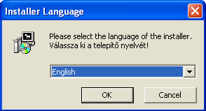
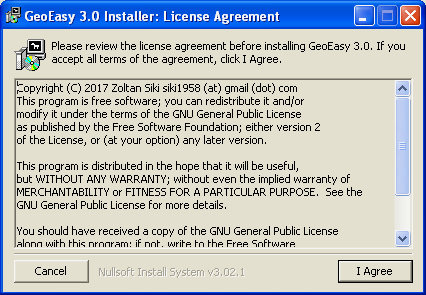
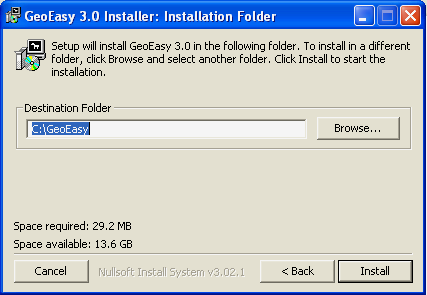
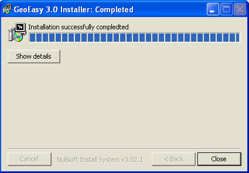

Installation Guide GeoEasy 3
============================

GeoEasy can be used on any Window/Linux box. There are no special requirements
for the hardware.

Supported operating systems
---------------------------

* Windows XP/2000/7/8/10 32 or 64 bit
* Linux with X11 Ubuntu/Fedora/debian 64 bit
* Android (experimental)

Windows Installation
--------------------

Windows binary release
......................

To install binary release on your Windows machine dowload the installer
from http://digikom.hu/english/geo_easy_e.html, it is generated by NSIS
(Nullsoft Scriptable Install System), an open
source installation kit generator for Windows.

Start the installer (Gizi3xxSetup.exe). First you have to select the language 
for installation (English, German, Hungarian).

	Select installation language

After selecting the language for installation a setup wizard starts. In the 
first dialog read and accept the license agreement.

	Accept license agreement

In the second dialog select the target folder for the installation. Please
do not choose an installation path, which contains space or special characters.

	Select target folder and start installation

In the last dialog you can start the installation process.

	Exit wizzard

After successful installation the GeoEasy icon can be found on the desktop and in the programs menu.

	GeoEasy icon

Windows portable release
........................

There is a portable Windows zip file. It should be unziped into a new empty
folder (for example c:\\GeoEasy). 
If you would like to export to GPX or KML format, set up an environment
variable *PROJ_LIB* to the root directory of GeoEasy.

.. code::

	setx PROJ_LIB=C:\GeoEasy

Linux Installation (Ubuntu)
---------------------------

Prerequisites
.............

Install tcl/tk on your platform (https://www.tcl.tk/software/tcltk/)

.. code:: bash

	sudo apt-get install tcl tk

Install proj (https://proj4.org)

.. code:: bash

	sudo apt-get install proj-bin

Install GNU Gama (https://www.gnu.org/software/gama/)
There is no binary package for Ubuntu, make it from source.

Install Triangle (https://github.com/MrPhil/Triangle)

.. code:: bash

	sudo apt-get install triangle-bin

Debian package
..............

There is a Debian package for Debian/Ubuntu Linux distributions which can be downloaded from
http://digikom.hu/english/geo_easy_e.html, it is a standard Debian package (geoeasy*version*-wheezy_all.deb). You can use the package manager to install it (right click on the file in the file manager or use dpkg)

.. code:: bash

	sudo dpkg -i geoeasy*version*-wheezy_all.deb

To start GeoEasy select it from the menu or type in the terminal window:

.. code:: bash

	geoeasy

The Debian install package was created by https://github.com/zvezdochiot.

Ubuntu binary release
.....................

There is a compressed Linux binary release which can be downloaded from
http://digikom.hu/english/geo_easy_e.html, it is a simple tar-gzip (Gizi*version*Linux.tgz) file. 
The following commands have to be executed (it is supposed the tgz file is 
downloaded into your home directory):

.. code:: bash

	mkdir GeoEasy
	cd GeoEasy
	tar xvzf ../Gizi3xxLinux.tgz

.. .note:
	the name of the tgz file is changed release by release, you can find 
	development (alfa/beta) releases e.g. Gizi303devLinux.tgz

You can start GeoEasy from the installation directory using the command:

.. code:: bash

	cd ~/GeoEasy
	./GeoEasy

You can create a shell script file to start GeoEasy from any directory.

.. code:: bash

	pushd ~/GeoEasy
	./GeoEasy
	popd

Copy this file into a directory on the PATH.

Install source release (Ubuntu)
...............................

Download the source files from GitHub (github.com/zsiki/GeoEasy) either
the zip file or *git clone* the repository. If you would like to update your
version regularly, then the *git clone* should be prefered.

.. code:: bash

	git clone https://github.com/zsiki/GeoEasy.git

Change directory to **GeoEasy/src** and
run the following commands from the command line, to prepare it.

.. code:: bash

	cd GeoEasy/src
	make source
	chmod +x geo_easy.tcl

Make a symbolic link from the GeoEasy/src directory to the external programs.

.. code:: bash

	cd GeoEasy/src
	ln -s /usr/bin/cs2cs cs2cs
	ln -s /usr/local/bin/gama-local gama-local
	ln -s /usr/bin/triangle triangle

Alternatively you can change the path to these programs in the geo\_easy.msk file. 

.. code:: tcl

	set gamaProg {/usr/local/bin/gama-local/gama-local}
	...
	set triangleProg {/usr/bin/triangle}
	...
	set cs2csProg {/usr/bin/cs2cs}

Or if the commands are on the PATH input only the name of the commands in the 
geo_easy.msk file.

.. code:: tcl

	set gamaProg {gama-local}
	...
	set triangleProg {triangle}
	...
	set cs2csProg {cs2cs}

.. note::

 	The path to the external program may be different, depending on 
	your settings and Linux distro.

To start the program use the following command from the **src** directory:

.. code:: bash

	cd GeoEasy/src
	wish geo_easy.tcl

or

.. code:: bash

	cd GeoEasy/src
	./geo_easy.tcl

To update to the actual master on GitHub simply *git pull* it, from the GeoEasy
directory.

.. code:: bash

	cd GeoEasy
	git pull

The preparation should be repeated (make source).

