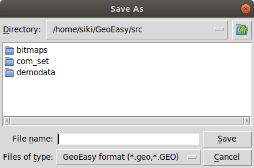
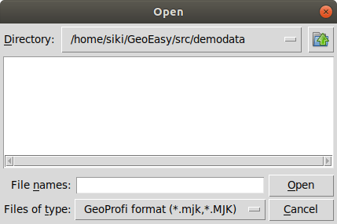
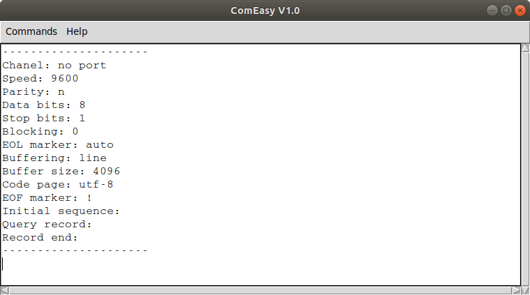
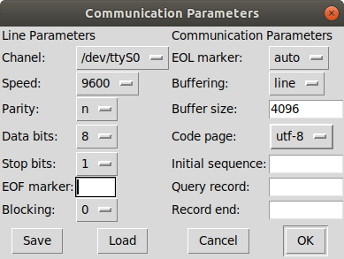
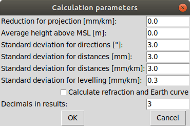
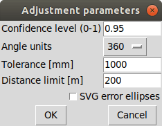
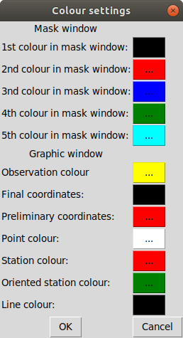
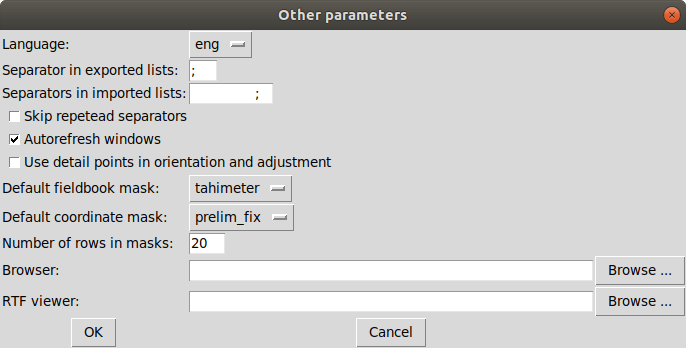
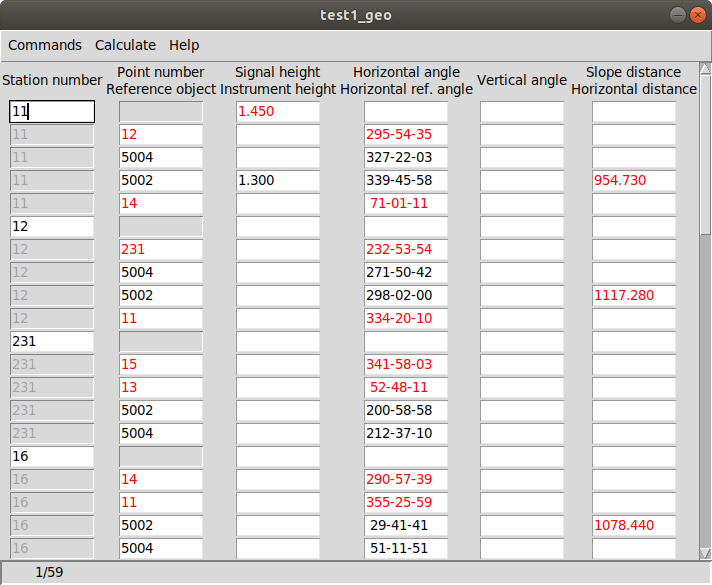
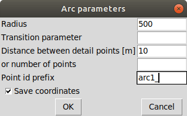

GeoEasy 3.1
===========
Reference Guide
===============

GeoEasy is a complex tool for land surveyors 

* to calculate coordinates from observations,
* to convert surveyors' data set into different formats,
* to generate TINs and DEMs and calculate volumes,
* to adjust 1D/2D/3D networks,
* to calculate parameters of regression shape over points

The program supports several input and
output formats, so it can easily be inserted into user’s work-flow.

Starting the program
--------------------

GeoEasy accepts command line parameters. The language of the user interface
can be selected and input data set can be given.

GeoEasy by default uses the language of the operating system if it is
available. Five languages are supported when writing this documentation:
English, German, Russian, Czeh and Hungarian.

You can switch to a different language from the default by the *--lang* 
command line switch. The ISO 639-1 two or ISO 639-2/B three letters codes 
are accepted. For example:

.. code:: bash

	geoeasy --lang hun

Log messages and calculation results are written to a log beside the
calculation results window. The default location of the log file is the
user's home directory and the name is *geo_easy.log*. Using the *--log*
command line parameter the name and the location of the log file can be
given in the command line. For example:

.. code:: bash

	geoeasy --log /tmp/mylog.log

.. note:: For Linux users

	If no log file needed for you, you can specify *--log /dev/null* to 
	supress logging. There are two more special log file specifications,
	the *stdout* and the *stderr*. Giving one of these as log file, the
	log messages are sent to the teminal window.

After the optional language and log switches you can give a serie of
GeoEasy data sets and/or Tcl scripts. For example:

.. code:: bash

	geoeasy --lang hun ~/demodata/test1.geo ./startup.tcl

GeoEasy main window
-------------------

Starting the program the main window appears at the upper left corner of the 
display. This window has only menus and decorations. If the globe is not
rotating the program is busy, the user have to wait.

File menu
~~~~~~~~~

In the file menu besides the file and project handling functions the
communicaton program (ComEasy) and settings can be found.

New
...

A new geo data set is created, in the **Save As** dialog of the operating system
the user can set the location and the name of the new file.
The type of the new file will be the nativ GeoEasy *geo* format.

Load
....

Open one or more data sets. There are several data types you can select from
(e.g. .geo, .csv, .gsi, etc). You can select more files to load, use Shift or
Ctrl key to select more files. Only the 
memory of the computer limits the number of loaded data sets.

If the observations were made in face left and face right, from the readings on
the horizontal and vertical circles and the distances an average is calculated.
GeoEasy stores and uses these average valuesi only.
Averages are calculated if the collimation and index errors are below the 
**maxColl** and **maxIndex** values set in the geo_easy.msk file.

.. note::
	The name of the loaded data sets must be unique even if they were
	loaded from different folders. For technical reasosns an underline 
	character is inserted at the beginning of the name, if the filename starts
	with a number.

Close
.....

Close a loaded data set. Beside this menu option a cascading list of the
loaded data sets pops up. The user can select a data set name from the list.
If the data set to be closed have been changed, the user has an option to save 
it.

Save
....

Save a changed data set. Beside this menu option a cascading list of the
loaded data sets pops up. The user can select a data set name from the list.
The data set is saved to GeoEasy geo format even if the type of opened data
set is different. The name and the folder of the
files is the same as the loaded data set.

Save all
........

Save all changed data sets to GeoEasy format.

Save as
.......

Save the selected data set into a different folder/name or type.
Beside this menu option a cascading list of the
loaded data sets pops up.
After selecting a file, in the Save As dialog box you can choose location, name
and type for the output file. After saving the original data set left opened.

Merge
.....

Merge all loaded data sets into a single GeoEasy data set.
After merging the original data sets left opened and the merged data set is not
loaded. If the same point has coordinates in more than one data set the first
coordinates found are saved to the merged data set.

GNU Gama export
...............

Export observations and coordinates into a GNU Gama XML file. 
First the network dimension (type of file 1D/2D/3D) and output file name is 
selected. Then you can 
select fixed and adjusted points. Only the observation belonging to the 
selected points are written to the output file.
If no fixed points are selected a free network adjustment is solved.

.. note::

	GNU Gama export is only necessary if you would like edit the 
	xml file before adjustment.

Load project
............

Load a previously saved project. Data set and windows are opened as saved to
the project.

Save project
............

Save the actual state of GeoEasy. The list of opened datasets (geo and tin) and
windows are saved into the project file (.gpr). The project file is a simple
text file.

Close project
.............

Close all opened data sets and windows except **Calculation results** and 
main window.

ComEasy
.......

ComEasy is the communication module which can communicate with the instruments
through serial (RS-232) line.

Before starting download or upload to/from the instrument, the parameters of
the serial line have to be set (e.g. speed, data bits, parity, stop bits) using
**Commands/Settings** from the menu.

Select **Commands/Download** from the menu to start downloading data from the
instrument. Set the output file in the displayed dialog box and start
data transmission on the instrument.

Statistics
..........

Summary information are shown in a popup windows, number of loaded data sets,
number of points, number of unknown points, number of detail points,
number of stations, number of known stations, number of occupied points,
number of oriented stations.

Calculation parameters
......................

Reduction for projection [mm/km]:
	the change of the distances caused by the projection

Average height above MSL [m]:
	used to reduce distances to MSL

Standard deviation for directions ["]:
	mean error for directions and zenith angles in arc seconds

Standard deviation for distances [mm]:
	additive item for the mean error of distances

Standard deviation for distances [mm/km]:
	multiplier item for the mean error of distances

Standard deviation of levelling [mm/km]:
	relative mean error for levelling

Calculate refraction and Earth curve:
	turn on to consider the affect of refraction and Earth curve for
	distances longer than 400 meters

Decimals in results:
	number of figures after the decimal point in the Calculation results
	window, field-books and coordinate lists

Adjustment parameters
.....................

Confidence level (0-1):
	Confidence level for detecting blunder, usual value 0.95 or 0.99.

Angle units:
	Angle units in the output of adjustment (360 for DMS, 400 for GON)

Tolerance [mm]:
	Maximal linear difference between observations and preliminary 
	coordinates. Observations over limit are not considered in the adjustment.

Distance limit [m]:
	Mean error for directions are enlarged linearly below this distance limit.
	For example if the distance limit is 200 meters and the mean error for
	directions is 3", the mean error for a 50 meters long direction will be
	200 / 50 * 3" = 12".

SVG error ellipses:
	An SVG will be generated with the network and error ellipses.

Colors
......

The colours used by the program can be set here. Click on the coloured
button toselect another colour.

Other parameters
................

Language:
	Language of the user interface. You have to save parameters and restart
	the program to take affect.

Separator in exported lists:
	Separator character used in CSV export.

Separators in imported lists:
	List of separator characters in text import.

Skip repetead separators:
	MUltiple neighboring separators are considered as single separator.

Autorefresh windows:
	Refresh all opened windows if something changed.

Use detail points in orientation and adjustment:
	GeoEasy consider a point as detail point if its ID is number, it was not
	a station and only a polar observation is in the field-book for that
	point. These points are not selectable in orientation and network 
	adjustment.

Default fieldbook mask:
	The name of the default fieldbook mask. You can select from the loaded
	masks.

Default coordinate mask:
	The name of the default fieldbook mask. You can select from the loaded
	masks.

Number of rows in masks:
	The default number of rows in the fieldbooks and coordinate lists.

Browser:
	The path to the browser program used to open HTML files.
	It is a Linux only parameter.

RTF viewer:
	The path to the dociment viewer program for RTF files.
	It is a Linux only parameter.

Save parameters
...............

Save settings to *geo\_easy.msk* file.
This file is used to set the parameters after starting the program.

Exit
....

Close the application. If unsaved data exists you have a chance to save it.

Edit menu
~~~~~~~~~

The menu options in the edit menu can be used to display and edit GeoEasy
data set. A GeoEasy data set consists of three parts:

* observations (field-book)
* coordinates
* observation parameters

Observations
............

This menu option has a cascading menu with the name of the loaded GeoEasy data 
sets. After selecting a data set it is opened in the default mask. A mask is a
windows with tabular data, the *mask* name comes from the old Leica total 
stations.

The field-book contains two type of rows, station and obeservation records.
In the station records the station number is editable but the target point 
number not. The column headers may contain more labels, for example *target
height* and *instrument height*. The colour of the value defines the type of 
data.

The observations window contains a menu bar and pop up menus.

Coordinates
...........

This menu option has a cascading menu with the name of the loaded GeoEasy data 
sets. After selecting a data set it is opened in the default mask. A mask is a
windows with tabular data, the *mask* name comes from the old Leica total 
stations.

The coordinate window contains a menu bar and pop up menus.

Observation parameters
......................

The observation parameters are metadata about the observations and 
coordinates, id/name of observer, date, instrument type and standard
deviations. All fields are optional. If no standard deviations are given, the
values defined in the  **Calculation parameters** are used.

.. image:: rg_images/obsparam.png
	:align: center

Load mask definitions
.....................

Starting GeoEasy the mask definitions are loaded from the geo_easy.msk file.
Using this menu option mask definitions can be loaded from user created
file.

Calculate menu
~~~~~~~~~~~~~~

The calculation menu contains those calculation which works with several 
point and the results cause change more lines in fieldbooks, coordinate lists,
like for example traversing.

Orientations
............

This menu option calculates orientations for all unoriented known stations.
The results are listed in the **Calculation results** window and the orientation
angles are stored in the field-books.

.. code:: text

	2019.01.02 10:08 - Orientation - 11
	Point num  Code         Direction    Bearing   Orient ang   Distance   e" e"max   E(m)
	12                      295-54-35   212-30-25   276-35-50   1588.873    1   19    0.010
	14                       71-01-11   347-36-58   276-35-47   1637.971   -1   18   -0.010
	Average orientation angle                       276-35-48

	2019.01.02 10:08 - Orientation - 12
	Point num  Code         Direction    Bearing   Orient ang   Distance   e" e"max   E(m)
	231                     232-53-54   291-04-11    58-10-17   2243.319    0   16    0.010
	11                      334-20-10    32-30-25    58-10-15   1588.873   -1   19   -0.010
	Average orientation angle                        58-10-16

Preliminary orientations
........................

This menu option calculates orientations for all unoriented stations which 
have preliminary or final coordinates.
The results are listed in the **Calculation results** window and the orientation
angles are stored in the field-books.
This is useful before 2D or 3D network adjustment, to get preliminary
orientations.

Delete orientations
...................

This menu option removes all orientation angles from the loaded data sets.
It is useful if all orientations should be recalculated. First delete
orientations, than calculate orientations.

Traversing
..........

Different type of traversing lines can be solved. Before starting the 
traversing calculation the orientations have to be made at the start and
end point if possible.
The points in the travesing line are selected from the list of possible points.
The type of traversing line (closed line, loop, free, ...) is detected by
the program.

The calculation results are sent to **Calculation results** window.

.. note::

	Travesing points can be selected in the graphic window, too.

Traversing node
...............

A travesing node is an unknown point at which three or more free
travessing lines meet. First the coordinates of the node are calculated from
free travese lines as a weighted average. Finally the traversing lines
are solved as closed loop traversing.

Trigonomerical line
...................

This menu option calculates the elevations in a traverse line using
triginometric height calculation. Zenith angles have to be measured
between tranversing points. The points in thetrigonometric line are
selected from the list of possible points.

The calculation results are sent to **Calculation results** window.

Trigonometrical node
....................

Similiar to the traversing node, three or more free traversing lines
having the same endpoint are calculated.

Intersection of two lines
.........................

Two lines are given by two-two points and the intersection of the two lines
is calculated. The id/name of the intersection point can also be given if
so the intersection point is stored in the opened data sets.
The result of the calculation can be seen in the Calculation results window.
This calculation is made in 2D.

Point on line
.............

A new point is calculated along a line given by an offset from the first point.
Beside the offset (Horizontal distance) optionally the measured distance 
(total length) can be given. The total length is used to calculate a scale 
between the calculated and the measured lengths.
The result of the calculation can be seen in the Calculation results window.
This calculation is made in 2D.

Length
......

The lengths between a serie of points can be calculated. 
Both the total length and the individual distences are shown in the
*Calculation results* window. There is a tool in the graphic window,
where you can mark points by the mouse.

.. code:: text

	2018.12.23 17:27 - Distance calculation
	Point num          E            N         Length
	11            91515.440     2815.220
	12            90661.580     1475.280     1588.873
	13            84862.540     3865.360     6272.268
	14            91164.160     4415.080     6325.552

	Sum                                     14186.693

Area
....

The area of a polygon can be calculated. Beside the area the perimeter and
side length are displayed in *Calulation results* window. 
There is a tool in the graphic window,
where you can mark points by the mouse.

.. code:: text

	2018.12.23 16:31 - Area calculation
	Point num          E            N         Length
	16            90050.240     3525.120
	231           88568.240     2281.760     1934.494
	232           88619.860     3159.880      879.636
	16            90050.240     3525.120     1476.275

	Area                                   618595.79840
	Perimeter                                4290.405

Arc setting out
...............

The coordinates of arc points can be calculated here. Pure arc and 
arc with transition curves are both allowed. Three points have to be
specified, first the intersection of tangents, an arbitrary point on the
incoming and outgoing tangent. Finally the otherr parameters of the arc
have to be given in a dialog box.

Leave the *Transition parameter* empty if pure arc is planed.
Optionally detail points can be calculated giving a distance or a number of 
points. If both fields are empty only the main points of arc are calculated.

.. code:: text

	2018.12.23 17:17 - Arc setting out
	Tangent length: 1510.37
	Radius: 500.00
	Alpha: 143-21-59  Beta:  36-38-01
	  Point id          E              N
	   arc1_ie      90023.538       3050.712
	   arc1_iv      90177.720       2113.983
	   arc1_ik      90438.941       2638.032

Preliminary coordinates
.......................

Preliminary coordinates are used to display points in the graphics window, 
before calculating final coordinates. Other usage of preliminary coordinates
belongs to network adjustment. Preliminary coordinates have different colour
(red is the default) in the coordinate list and in the graphic window.

Preliminay coordinates and orientations are calculated in an iteration. You 
may get a message about points which horizontal coordinates or elevation
cannot be calculated for.

Recalculate preliminary coordinates
...................................

All preliminary coordinates are deleted and the preliminary coordinate
calculation is invoked. It is useful if faullty preliminary coordinates 
were calculated caused by errors in the data sets. After corecting 
errors use this option to recalculate preliminary coordinates.

3D network adjustment, Horizontal network adjustment, Levelling network adjustment
..................................................................................

..note::

	Before adjustment you have the set/check the mean errors of observations and
	adjustment parameters.

During 3D network adjustment both horizontal coordinates an elevations are
calculated using the least squares method. During horizontan network
adjustment the horizontal coordinates are calculated. During levelling network
adjustment the elevations are calculated
All loaded data sets are considered during the adjustment calculation.
The three network adjusments are very similiar from the point of the user 
interface.

First you have to select unknown points from a list, the coordinates of these 
points are changed during the calculations. The list contains all points 
having preliminary or final coordinates considering the dimension of the
adjusted network (e.g. incase of 3D adjustment points having 3D coordinates
are listed). At least one point have to be selected.

.. image:: rg_images/adj1_3d.png
	:align: center

In the second list the fixed points can be selected. Here the points having 
final coordinates are only listed.  If none of the points are selected a 
free network adjusment is calculated.

.. image:: rg_images/adj2_3d.png
	:align: center

GeoEasy will prepare an xml file for GNU Gama with the coordinats of the 
selected points and observations among the selected unknown and fixes points.
The calculation is made by GNU Gama and the results of the calculation is
shown in thecalculation results window. Please use GNU Gama documentation
for the details of the result list.
The coordinates of the unknown points are updated in the coordinate lists 
after adjustent.

Coordinate transformation
.........................

Elevation transformation
........................

New detail points
.................

Calculate horizontal coordinates and elevations for all detail ponts which
have no final coordinates yet.

All detail point
................

Recalculates the coordinates, elevations of all detail points even 
already calculated.

3D intersections
................

This calculation calculates 3D positions from directions and
zenith angles measured from the endpoints of a base line.

Windows menu
~~~~~~~~~~~~

From the window menu new windows can be opened and the user can switch 
among opened windows.

New graphic window
..................

Open a new graphic window. The number of open graphic windows is limited to ten.
Each graphic window has menu and toolbar.

Log window
..........

Only one log window can be opened. It shows the resuts of calculations.

Console window
..............

In the console window users can input Tcl commands or load custom Tcl scripts.

Window list
...........

From the cascading menu beside this menu option, user can select one from the 
opened windows. The selected window is raised and become the active window.

Refresh all window
..................

Help menu
~~~~~~~~~

After some actions the content of the windows are not refeshed, user can use
this option to force a refresh all opened windows.

GeoEasy field-book window
-------------------------

Commands menu
~~~~~~~~~~~~~

Calculate menu
~~~~~~~~~~~~~~

Help menu
~~~~~~~~~

Popup menu
~~~~~~~~~~

GeoEasy coordinate list
-----------------------

Commands menu
~~~~~~~~~~~~~

Calculate menu
~~~~~~~~~~~~~~

Help menu
~~~~~~~~~

Popup menu
~~~~~~~~~~

GeoEasy graphic window
----------------------

Commands menu
~~~~~~~~~~~~~

Calculate menu
~~~~~~~~~~~~~~

DTM menu
~~~~~~~~

Help menu
~~~~~~~~~

Popup menu
~~~~~~~~~~

GeoEasy calculation results
---------------------------

All calculation results are sent to this window. Users can copy
selected part of the content from this window to the clipboarand paste that
to other application (e.g. into doc files).

.. note::

	On Windows operating system use the Ctrl/C to copy selected part to
	the clipboard. On Linux use middle mouse button click to paste
	selected part into another application.

All strings written to the Calculation results windoware also sent to the log
file. So if this windows is closed the calculation results are preserved in
the log and user can review them later.

File menu
~~~~~~~~~

GeoEasy consol window
---------------------

File menu
~~~~~~~~~

Appendices
==========

GeoEasy data format
-------------------

GeoEasy uses three files for each field-book, in the same folder. The name of 
these three files have to be the same.

	.geo
		the observations

	.coo
		the coordinates

	.par
		meta-data (optional)

Each line of the files consists of a list of code-value pairs. The order of the
code-valu pairs is not significant.

Beside the above mentioned data file there is a project file (.gpr) also to 
save the state of your work. The project file stores the opened data set names
and opened windows state. There is a .msk file beside the project file to save 
the state of parameters.

geo file
~~~~~~~~

Lines in the geo file contain station or observed point data. Station records
contain code 2 (station id) while observation records contain code 5/62 
(point id/reference id).

Allowed codes in station record:

	* 2 station ID (obligatory)
	* 3 instrument height
	* 101 average orientation angle
	* 103 average preliminary orientation angle

Allowed codes in observation record:

	* 5 point ID (obligatory)
	* 4 point code
	* 6 Signal height
	* 7 horizontal angle (radians)
	* 8 zenith angle (radians)
	* 9 slope distance (m)
	* 10 height difference (m)
	* 11 horizontal distance (m)
	* 112 repeat count
	* 120 height difference from levelling

Sample geo file

.. code:: ascii

	{2 11} {3 1.45}
	{62 12} {21 5.164598941}
	{5 5004} {7 5.713640739}
	{5 5002} {7 5.930037326} {11 954.73} {6 1.30}
	{62 14} {21 1.239527987}
	{2 12}
	{62 231} {21 4.064842739}
	{5 5004} {7 4.744590305}
	{5 5002} {7 5.201662947} {11 1117.28}
	{62 11} {21 5.835265947}
	{2 231}
	{62 15} {21 5.96845881}
	{62 13} {21 0.921587175}
	{5 5002} {7 3.507811212}
	{5 5004} {7 3.710909359}

coo file
~~~~~~~~

Each line in the coo file contains coordinate data of a point.
Allowed codes are:

	* 4 point code
	* 5 point ID
	* 37 north
	* 38 east
	* 39 elevation
	* 137 preliminary north
	* 138 preliminary east
	* 139 preliminary elevation
	* 237 mean error of noth coordinate (got from GNU Gama adjustment)
	* 238 mean error of east coordinate (got from GNU Gama adjustment)
	* 239 mean error of elevation (got from GNU Gama adjustment)

Sample coo file:

.. code::
	{5 1_sp} {139 123.94770} {38 89929.8365} {37 3249.9968}
	{5 2_sp} {139 124.25470} {38 90260.0046} {37 3267.5266}
	{5 3_sp} {139 136.88876} {38 90589.8991} {37 2934.9344}
	{5 101} {138 89817.6011} {137 3124.3328} {139 125.31640}
	{5 102} {138 89888.1756} {137 3112.6413} {139 126.83410}
	{5 103} {138 90043.3355} {137 3181.3309} {139 127.00320}
	{5 201} {138 90257.6411} {137 3134.3656} {139 124.37520}
	{5 202} {138 90112.9292} {137 3206.3220} {139 120.76200}
	{38 88568.24} {37 2281.76} {5 231}
	{38 88619.86} {37 3159.88} {5 232}
	
par file
~~~~~~~~

The par file contains only one line. Allowed codes are

	* 51 date
	* 52 time
	* 53 operator id/name
	* 55 instrument ID/name
	* 114 direction standard deviation (seconds)
	* 115 distance standard deviation (additive) (mm)
	* 116 distance standard deviation (multiplyer) (ppm)
	* 118 levelling stadard deviation (ppm)
	* 0 comment

All codes are optional.

Sample par file:

.. code:: ascii

	{51 2019-01-24} {55 "Leica TPS 1201"} {114 1} {115 1.5} {116 1}

gpr file
~~~~~~~~

The GeoEasy Project File (gpr) is divided into sections:

	data section
		list of opened data sets (relative path to project file or full path)
	
	win section
		list of opened windows with geometry and other settings
	
	dtm section
		name of opened digital terrain model

Sample project file:

.. code:: ascii

	[data]
	test1.geo
	[win]
	.g0 421x366+10+402 1 1 1 0 0 0.059952038369304558 88053.720000000001 2493.6599999999999
	.test1_coo prelim_fix 0 +867+245
	.log  +10+215

msk file
~~~~~~~~

GeoEasy configuration file. It is a Tcl executable file with saved
parameters.
It also contains the field-book and coordinate list definitions (masks).
Each mask has three lists to define data, field format and field size. 
These lits are collected in three associative arrays, the mask name is the
index. Separate arrays are
maintened for field-books and coordinate lists, geoMasks, geoMaskParams and
geoMaskWidths for field-books and cooMaks, cooMaksParams and cooMaksWidths
for coordinate lists.

geoMask definition:

   +------+-------------------------------------------------+
   | item | description                                     |
   +======+=================================================+
   |  1   | must be "table"                                 |
   +------+-------------------------------------------------+
   |  2   | number of rows in the table                     |
   +------+-------------------------------------------------+
   | 3..n | list of codes to be shown in fields             |
   |      | the order is significant                        |
   +------+-------------------------------------------------+

geoMaskParams definition

   +------+-------------------------------------------------+
   | item | description                                     |
   +======+=================================================+
   | 1..n | Format definition for the fields                |
   +------+-------------------------------------------------+

format definitions

   +--------------+-------------------------------------------+
   | definition   | description                               |
   +==============+===========================================+
   | -            | show the previous vele of the same code   |
   |              | used for station ID                       |
   +--------------+-------------------------------------------+
   | ""           | left aligned string                       |
   +--------------+-------------------------------------------+
   | FLOAT        | float value, the number of decials are    |
   |              | defined in calculation parameters         |
   +--------------+-------------------------------------------+
   | DEC n m      | float value with width n and m decimals   |
   +--------------+-------------------------------------------+
   | format %n.mf | same as DEC n m                           |
   +--------------+-------------------------------------------+
   | INT          | integer value                             |
   +--------------+-------------------------------------------+
   | DEC n        | integer value with width n                |
   +--------------+-------------------------------------------+
   | format %nd   | same as DEC n                             |
   +--------------+-------------------------------------------+
   | DMS          | angle in degree-minutes-seconds           |
   +--------------+-------------------------------------------+
   | DMS1         | angle in degree-minutes-seconds.tenth     |
   +--------------+-------------------------------------------+
   | GON          | angle in gons (4 decimals)                |
   +--------------+-------------------------------------------+
   | FEET         | float value changed from meter to feet    |
   +--------------+-------------------------------------------+
   | OL           | float value changed from meter to phatom  |
   +--------------+-------------------------------------------+

codes used

	+-----+------------------------------------+
	| 0   | Information                        |
	+=====+====================================+
	| 2   | Station number                     |
	+-----+------------------------------------+
	| 3   | Instrument height                  |
	+-----+------------------------------------+
	| 4   | Point code                         |
	+-----+------------------------------------+
	| 5   | Point number                       |
	+-----+------------------------------------+
	| 6   | Signal height                      |
	+-----+------------------------------------+
	| 7   | Horizontal angle                   |
	+-----+------------------------------------+
	| 8   | Vertical angle                     |
	+-----+------------------------------------+
	| 9   | Slope distance                     |
	+-----+------------------------------------+
	| 10  | Height diff                        |
	+-----+------------------------------------+
	| 120 | Height diff. levelling             |
	+-----+------------------------------------+
	| 11  | Horizontal distance                |
	+-----+------------------------------------+
	| 21  | Horizontal ref. angle              |
	+-----+------------------------------------+
	| 37  | Northing                           |
	+-----+------------------------------------+
	| 38  | Easting                            |
	+-----+------------------------------------+
	| 39  | Elevation                          |
	+-----+------------------------------------+
	| 51  | Date                               |
	+-----+------------------------------------+
	| 52  | Time                               |
	+-----+------------------------------------+
	| 53  | Operator id                        |
	+-----+------------------------------------+
	| 55  | Instrument id                      |
	+-----+------------------------------------+
	| 62  | Reference object                   |
	+-----+------------------------------------+
	| 100 | Orientation angle                  |
	+-----+------------------------------------+
	| 101 | Average orientation angle          |
	+-----+------------------------------------+
	| 102 | Prelim. orientation                |
	+-----+------------------------------------+
	| 103 | Average prelim. orientation        |
	+-----+------------------------------------+
	| 110 | Observer                           |
	+-----+------------------------------------+
	| 111 | Point order                        |
	+-----+------------------------------------+
	| 112 | Repeat count                       |
	+-----+------------------------------------+
	| 114 | Direction stddev [seconds]         |
	+-----+------------------------------------+
	| 115 | Distance stddev (additive) [mm]    |
	+-----+------------------------------------+
	| 116 | Distance stddev (multiplyer) [ppm] |
	+-----+------------------------------------+
	| 117 | Total length                       |
	+-----+------------------------------------+
	| 118 | Levelling stddev [mm/km]           |
	+-----+------------------------------------+
	| 137 | Northing prelim.                   |
	+-----+------------------------------------+
	| 138 | Easting prelim.                    |
	+-----+------------------------------------+
	| 139 | Height prelim.                     |
	+-----+------------------------------------+
	| 140 | EPSG code                          |
	+-----+------------------------------------+
	| 237 | Northing stdev                     |
	+-----+------------------------------------+
	| 238 | Easting stdev                      |
	+-----+------------------------------------+
	| 239 | Height stdev                       |
	+-----+------------------------------------+

