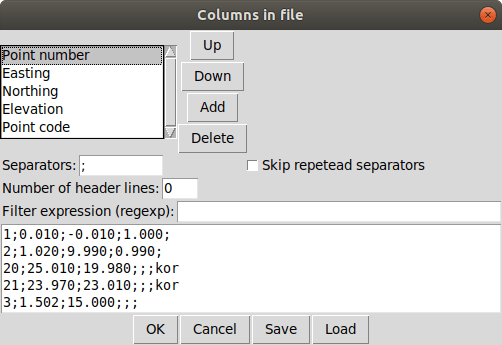
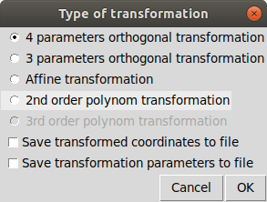
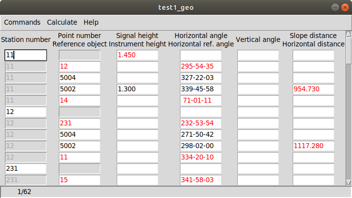
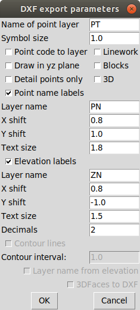
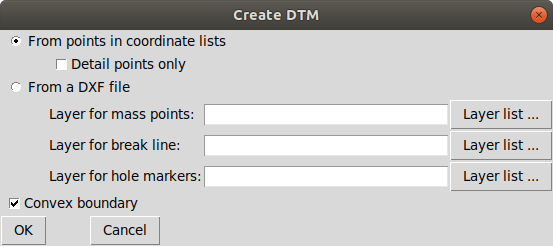
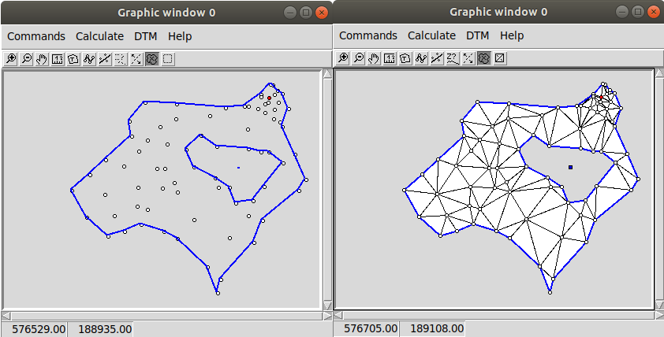
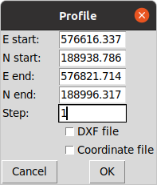
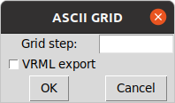

GeoEasy 3.2
===========
Reference Guide
===============

.. contents:: Table of Contents

GeoEasy is a complex tool for land surveyors 

* to calculate coordinates from observations,
* to convert surveyors' data set into different formats,
* to generate TINs and DEMs and calculate volumes,
* to adjust 1D/2D/3D networks,
* to calculate parameters of regression shape over points

The program supports several input and
output formats, so it can easily be inserted into user's work-flow.

Starting the program
--------------------

The Windows setup places az icon on the desktop and adds an item to the programs menu. On Linux the program should be started from the command line.
GeoEasy accepts command line parameters. The language of the user interface
can be selected and input data set can be given.

.. note:: for Windows users

	You can start GeoEasy from the command line on Windows, too. 
	Open a cmd window, change 
	directory to the GeoEasy installation folder (c:\GeoEasy is the default),
	finally enter *GeoEasy* to start the program.
Using the --help parameter you can see the available command line
options, all are optional

.. code:: bash

	./geo_easy.tcl --help
	GeoEasy 3.2.1

	Usage: geoeasy [options] [files]
 	options:
  	--help [string] - print help info and exit {authors, modules, version}
  	--lang [string] - switch to a different language {cze eng es ger hun pl rus}, default=auto
  	--log [string] - select log {path/to/file.log | stdout | stderr}, default=/home/siki/geo_easy.log
  	--exp extension - export files from command line with the given extension
  	--nogui - process command line files and exit
 	files:
  		optional list of files of four types
    		geo_easy data files (.geo, .gsi, etc.) to load
    		geo_easy project file (.gpr) to load
    		tcl script files (.tcl) to execute/load
    		mask definition files (.msk) to load
 	the order of the files in the command line is the order of processing

GeoEasy by default uses the language of the operating system if it is
available (GeoEasy has been localized to that language).
Seevn languages are supported when writing this documentation:
Czeh, English, German,  Hungarian, Polish, Russian and Spanish.

You can switch to a different language from the default by the *--lang* 
command line switch. The ISO 639-1 two or ISO 639-2/B three letters codes 
are accepted. For example to start with Hungarian language:

.. code:: bash

	geoeasy --lang hun

Log messages and calculation results are written to a log file beside the
calculation results window. The default location of the log file is the
user's home directory and the name is *geo_easy.log*. Using the *--log*
command line parameter the name and the location of the log file can be
given in the command line. The actual user must have write access to the given 
log file. For example:

.. code:: bash

	geoeasy --log /tmp/mylog.log

.. note:: For Linux users

	If no log file needed for you, you can specify *--log /dev/null* to 
	supress logging. There are two more special log file specifications,
	the *stdout* and the *stderr*. Giving one of these as log file, the
	log messages are sent to the terminal window.

After the optional language and log switches you can give a serie of
GeoEasy data sets and/or Tcl scripts. For example:

.. code:: bash

	geoeasy --lang hun ~/demodata/test1.geo ./startup.tcl

Using the --exp and --nogui options you can use GeoEasy as a batch data
converter. You can specify several input files.

.. code:: bask

	geoeasy --nogui --exp csv demodata/test1.geo demodata/test_trafo.geo

You will get the test1.csv and demodata/test_trafo.csv files in the folder of the input files.

GeoEasy main window
-------------------

Starting the program (without the nogui parameter) the main window appears at the upper left corner of the 
display. This window has only menus and decorations. If the globe is not
rotating the program is busy, the user have to wait.

File menu
~~~~~~~~~

In the file menu besides the file and project handling functions the
communicaton program (ComEasy) and settings can be found.

New
...

A new geo data set is created, in the **Save As** dialog of the operating system
the user can set the location and the name of the new file.
The type of the new file will be the nativ GeoEasy *geo* format. 
The geo/coo/par files will be created on the disk when you save data set.

.. figure:: rg_images/new.png
	:align: center

	File name and folder selection for new data set

Load
....

Open one or more data sets. There are several data types you can select from
(e.g. .geo, .csv, .gsi, etc). You can select more files to load, use Shift or
Ctrl key to select more files. Only the 
memory of the computer limits the number of loaded data sets.

.. figure:: rg_images/load.png
	:align: center

	Input data set selection

If the observations were made in face left and face right, from the readings on
the horizontal and vertical circles and the distances an average is calculated.
GeoEasy stores and uses these average values only.
Averages are calculated if the collimation and index errors are below the 
**maxColl** and **maxIndex** values set in the geo_easy.msk file.

.. note::
	The name of the loaded data sets should be unique. You will see the
	same data set name twice in the cascading menus.

Loading flexible format files
.............................

There are two file types which internal structure is flexible. These are the 
.dmp (for observations) and .csv (for coordinates) types. 
In case of these input files the data structure can be user 
defined, the user can set order and contents of the columns in the file while loading.
When you select .dmp or .csv file another dialog is opened.

	Text file input dialog

In the upper part of the dialog you can set the meaning and order of columns.
In case of csv the available columns are: *Point number, Easting, Northing,
Elevation, Point code, Point order, Easting prelim., Northin prelim.,
Height prelim* and the special *Skip*. In the dmp (dump) file the following 
columns are allowed: *Station number*, *Point number*, *Horizontal angle*, 
*Vertical angle*, *Slope distance*, *Signal height*, *Instrument height*, 
*Horizontal distance*, *Point code*, *Height diff*, *Height diff leveling* and the 
special *Skip*. Angles can be in radians or DMS (ddd-mm-ss format).
A sample dmp file (station number can be empty if it is not changed).

.. code:: text
	Station;Target;Hz;V;SD
	12;23;23-45-12;87-51-10;234.201
	;32;123-23-35;91-03-21
	;54;200-12-34;85-40-12;85.342
	48;57;32-01-06;90-10-31;121.308
	48;59;79-23-56;88-44-22;242.159

When you open the dialog the default
columns are in the list. Press **Add** button to add new column and select
from the opened list. The new column will be added to the end of the list. 
If you would like to change the order of columns, click on a column and the 
**Up**, **Down** and **Delete** buttons became active. The special *Skip* column can
be used to skip a column in the input file.

Multiple separators can be defined, defaults are tab and semicolon.
The *Skip repeated separators* option can be useful for example if you have
space tabbed file (different number of spaces among the columns).

The *Number of header lines* allows to skip the first few lines in the input
(e.g. header lines).

A *Filter expression* can be defiend to filter rows. A regular expression can
also be used. It works as the Linux *grep* command.

At the bottom part of the dialog the first five rows of the input file are shown.

The **Save** and **Load** buttons can be used to save or load setting to/from
a txt/csv file definition (\*.txp). Be careful, the saved file definitions for 
.dmp and .csv files are not compatible (available column sets are different).

Close
.....

Close a loaded data set. Beside this menu option a cascading list of the
loaded data sets pops up. The user can select a data set name from the list.
If the data set to be closed have been changed, the user has an option to save 
it after a question.

Save
....

Save a changed data set. Beside this menu option a cascading list of the
loaded data sets pops up. The user can select a data set name from the list.
The data set is saved to GeoEasy *geo* format even if the type of opened data
set is different. The name and the folder of the
files is the same as the loaded data set.

Save all
........

Save all changed data sets to GeoEasy format.

Save as
.......

Save the selected data set into a different folder/name or type.
Beside this menu option a cascading list of the
loaded data sets pops up.
After selecting a file, in the Save As dialog box you can choose location, name
and type for the output file. After saving the original data set left opened.

Merge
.....

Merge all loaded data sets into a single GeoEasy data set.
After merging the original data sets left opened and the merged data set is not
loaded. If the same point has coordinates in more than one data sets the first
coordinates found are saved to the merged data set.

GNU Gama export
...............

Export observations and coordinates into a GNU Gama XML file. 
First the network dimension (type of file 1D/2D/3D) and output file name is 
selected. Then you can 
select fixed and adjusted points. Only the observation belonging to the 
selected points are written to the output file.
If no fixed points are selected a free network adjustment is solved.

.. note::

	GNU Gama export is only necessary if you would like manually fine tune
	the parameters in the xml file before adjustment.

Load project
............

Load a previously saved project. Data sets and windows are opened as saved to
the project.

Save project
............

Save the actual state of GeoEasy. The list of opened datasets (geo and tin) and
windows are saved into the project file (.gpr). The project file is a simple
text file (see detailed description of project file in appendix).

Close project
.............

Close all opened data sets and windows except **Calculation results** and 
main window. It can be used even if you haven't opened a project.

ComEasy
.......

ComEasy is the communication module which can communicate with the instruments
through serial (RS-232) line.

.. figure:: rg_images/comeasy.png
	:align: center

	ComEasy window

Before starting download or upload to/from the instrument, the parameters of
the serial line have to be set (e.g. speed, data bits, parity, stop bits) using
**Commands/Settings** from the menu.

.. figure:: rg_images/compars.png
	:align: center

	Communication parameters

Select **Commands/Download** from the menu to start downloading data from the
instrument. Set the output file in the displayed dialog box and start
data transmission on the instrument.

Statistics
..........

Summary information are shown in a popup windows, number of loaded data sets,
number of points, number of unknown points, number of detail points,
number of stations, number of known stations, number of occupied points,
number of oriented stations.

Calculation parameters
......................

.. figure:: rg_images/calcpar.png
	:align: center

	Calculation parameters

Angle units
	angle units used in field-book and calculation results windows
	(DMS, GON, DMS1, DEG)

Distance units
	distance and coordinate units used in the mask and calculation results windows
	(m, feet)

Reduction for projection [mm/km]:
	the change of the distances caused by the projection

Average height above MSL [m]:
	used to reduce distances to MSL, set to zero to turn of correction

Standard deviation for directions ["]:
	mean error for directions and zenith angles in arc seconds, 
	used by network adjusment

Standard deviation for distances [mm]:
	additive item for the mean error of distances, used by
	
Standard deviation for distances [mm/km]:
	multiplier item for the mean error of distances

Standard deviation of levelling [mm/km]:
	relative mean error for levelling

Calculate refraction and Earth curve:
	turn on to consider the affect of refraction and Earth curve for
	distances longer than 400 meters

Decimals in results:
	number of figures after the decimal point in the Calculation results
	window, field-books and coordinate lists

Adjustment parameters
.....................

.. figure:: rg_images/adjpar.png
	:align: center

	Adjustment parameters

Confidence level (0-1):
	Confidence level for detecting blunder, usual value 0.95 or 0.99.

Angle units:
	Angle units in the output of adjustment (360 for DMS, 400 for GON)

Tolerance [mm]:
	Maximal linear difference between observations and preliminary 
	coordinates. Observations over limit are not considered in the adjustment.

Distance limit [m]:
	Mean error for directions are enlarged linearly below this distance limit.
	For example if the distance limit is 200 meters and the mean error for
	directions is 3", the mean error for a 50 meters long direction will be
	200 / 50 * 3" = 12".

SVG error ellipses:
	An SVG file will be generated with the network and error ellipses.

Colors
......

.. figure:: rg_images/colpar.png
	:align: center

	Colour settings

The colours used by the program can be set here. Click on the coloured
buttons to select another colour.

Other parameters
................

.. figure:: rg_images/otherpar.png
	:align: center

	Other parameters

Language:
	Language of the user interface. You have to save parameters and restart
	the program to take affect. Setting this disables the automatic language 
	selection. You can also change language for the actual session using --lang 
	command line option.

Separator in exported lists:
	Separator character used in CSV export.

Separators in imported lists:
	List of separator characters in text import.

Skip repetead separators:
	MUltiple neighboring separators are considered as single separator.

Autorefresh windows:
	Refresh all opened windows if something changed.

Use detail points in orientation and adjustment:
	GeoEasy consider a point as detail point if its ID is number, it was not
	a station and only a polar observation is in the field-book for that
	point. These points are not selectable in orientation and network 
	adjustment if this option is off.

Default fieldbook mask:
	The name of the default fieldbook mask. You can select from the loaded
	masks.

Default coordinate mask:
	The name of the default coordinate list mask. You can select from the loaded
	masks.

Number of rows in masks:
	The default number of rows in the fieldbooks and coordinate lists.

Browser:
	The path to the browser program used to open HTML files.
	It is a Linux only parameter.

RTF viewer:
	The path to the document viewer program for RTF files.
	It is a Linux only parameter.

Save parameters
...............

Save settings to *geo\_easy.msk* file.
This file will be used to set the parameters after restarting the program.

Exit
....

Close the application. If unsaved data exists you have a chance to save it.

Edit menu
~~~~~~~~~

The menu options in the edit menu can be used to display and edit GeoEasy
data set. A GeoEasy data set consists of three parts:

* observations (field-book)
* coordinates
* observation parameters

Observations
............

This menu option has a cascading menu with the name of the loaded GeoEasy data 
sets. After selecting a data set it is opened in the default mask. A mask is a
windows with tabular data, the *mask* name comes from the old Leica total 
stations.

.. figure:: rg_images/fb.png
	:align: center

	Observations

The field-book contains two type of rows, station and observation records.
In the station records the station number is editable but the target point 
number not. The column headers may contain more labels, for example *target
height* and *instrument height*. The colour of the value defines the type of 
data.

The observations window contains a menu bar and pop up menus.

Coordinates
...........

This menu option has a cascading menu with the name of the loaded GeoEasy data 
sets. After selecting a data set it is opened in the default mask. A mask is a
windows with tabular data, the *mask* name comes from the old Leica total 
stations.

.. figure:: rg_images/fb.png
	:align: center

	Coordinate list

The coordinate window contains a menu bar and pop up menus.

Observation parameters
......................

The observation parameters are metadata about the observations and 
coordinates, id/name of observer, date, instrument type and standard
deviations. All fields are optional. If no standard deviations are given, the
values defined in the  **Calculation parameters** are used.

.. figure:: rg_images/obsparam.png
	:align: center

	Observation parameters

Load mask definitions
.....................

Starting GeoEasy the mask definitions are loaded from the geo_easy.msk file.
Using this menu option additional mask definitions can be loaded from user created
file. You can create your own mask definitions in a file. It can be loaded by 
this menu option. You can also extend the mask definitions in the geo_easy.msk file
but if you upgrade GeoEasy to a new version you will lost your own mask definitions

Calculate menu
~~~~~~~~~~~~~~

The calculation menu contains those calculation which works with several 
point and the results cause change more lines in fieldbooks, coordinate lists,
like for example traversing.

Orientations
............

This menu option calculates orientations for all unoriented known stations.
The results are listed in the **Calculation results** window and the orientation
angles are stored in the field-books. You can view orientation angles if you change the mask to *orientation*.

.. code:: text

	2019.01.02 10:08 - Orientation - 11
	Point num  Code         Direction    Bearing   Orient ang   Distance   e" e"max   E(m)
	12                      295-54-35   212-30-25   276-35-50   1588.873    1   19    0.010
	14                       71-01-11   347-36-58   276-35-47   1637.971   -1   18   -0.010
	Average orientation angle                       276-35-48

	2019.01.02 10:08 - Orientation - 12
	Point num  Code         Direction    Bearing   Orient ang   Distance   e" e"max   E(m)
	231                     232-53-54   291-04-11    58-10-17   2243.319    0   16    0.010
	11                      334-20-10    32-30-25    58-10-15   1588.873   -1   19   -0.010
	Average orientation angle                        58-10-16

Preliminary orientations
........................

This menu option calculates orientations for all unoriented stations which 
have preliminary or final coordinates.
The results are listed in the **Calculation results** window and the orientation
angles are stored in the field-books.
This is useful before 2D or 3D network adjustment, to get preliminary
orientations.

Delete orientations
...................

This menu option removes all orientation angles from the loaded data sets.
It is useful if all orientations should be recalculated. First delete
orientations, than calculate orientations.

Traversing
..........

Different type of traversing lines can be solved. Before starting the 
traversing calculation the orientations have to be made at the start and
end point if possible.
The points in the travesing line are selected from the list of possible points.
The type of traversing line (closed line, loop, free, ...) is detected by
the program.

The calculation results are sent to **Calculation results** window.

.. note::

	Travesing points can be selected by the mouse in the graphic window, too.
	See traversing tool.

Traversing node
...............

A travesing node is an unknown point at which three or more free
travessing lines meet. First the coordinates of the node are calculated from
free travese lines as a weighted average. Finally the traversing lines
are solved as closed loop traversing.

Trigonomerical line
...................

This menu option calculates the elevations in a traverse line using
triginometric height calculation. Zenith angles have to be measured
between tranversing points. The points in the trigonometric line are
selected from the list of possible points.

The calculation results are sent to **Calculation results** window.

Trigonometrical node
....................

Similiar to the traversing node, three or more free trigonometric lines
having the same endpoint are calculated.

Intersection of two lines
.........................

Two lines are given by two-two points and the intersection of the two lines
is calculated. The id/name of the intersection point can also be given if
so the intersection point is stored in the opened data sets.
The result of the calculation can be seen in the Calculation results window.
This calculation is made in 2D.

Point on line
.............

A new point is calculated along a line given by an offset from the first point.
Beside the offset (Horizontal distance) optionally the measured distance 
(total length) can be given. The total length is used to calculate a scale 
between the calculated and the measured lengths.
The result of the calculation can be seen in the Calculation results window.
This calculation is made in 2D.

Length
......

The lengths between a serie of points can be calculated. 
Both the total length and the individual distances are shown in the
*Calculation results* window. There is a tool in the graphic window,
where you can mark points by the mouse.

.. code:: text

	2018.12.23 17:27 - Distance calculation
	Point num          E            N         Length
	11            91515.440     2815.220
	12            90661.580     1475.280     1588.873
	13            84862.540     3865.360     6272.268
	14            91164.160     4415.080     6325.552

	Sum                                     14186.693

Area
....

The area of a polygon can be calculated. Beside the area the perimeter and
side lengths are displayed in *Calulation results* window. 
There is a tool in the graphic window,
where you can mark points by the mouse.

.. code:: text

	2018.12.23 16:31 - Area calculation
	Point num          E            N         Length
	16            90050.240     3525.120
	231           88568.240     2281.760     1934.494
	232           88619.860     3159.880      879.636
	16            90050.240     3525.120     1476.275

	Area                                   618595.79840
	Perimeter                                4290.405

Arc setting out
...............

The coordinates of arc points can be calculated here. Pure arc and 
arc with transition curves are both allowed. Three points have to be
specified, first the intersection of tangents, an arbitrary point on the
incoming and outgoing tangent. Finally the other parameters of the arc
have to be given in a dialog box.

.. figure:: rg_images/arc.png
	:align: center

	Arc parameters

Leave the *Transition parameter* empty if pure arc is planed.
Optionally detail points can be calculated giving a distance or a number of 
points. If both fields are empty only the main points of arc are calculated.

.. code:: text

	2018.12.23 17:17 - Arc setting out
	Tangent length: 1510.37
	Radius: 500.00
	Alpha: 143-21-59  Beta:  36-38-01
	  Point id          E              N
	   arc1_ie      90023.538       3050.712
	   arc1_iv      90177.720       2113.983
	   arc1_ik      90438.941       2638.032

Preliminary coordinates
.......................

Preliminary coordinates are used to display points in the graphics window, 
before calculating final coordinates. Other usage of preliminary coordinates
belongs to network adjustment. Preliminary coordinates have different colour
(red is the default) in the coordinate list and in the graphic window.

Preliminay coordinates and orientations are calculated in an iteration. You 
may get a message about points which horizontal coordinates or elevations
cannot be calculated for.

Recalculate preliminary coordinates
...................................

All preliminary coordinates are deleted and the preliminary coordinate
calculation is invoked. It is useful if faullty preliminary coordinates 
were calculated caused by errors in the data sets. After corecting 
errors use this option to recalculate preliminary coordinates.

3D network adjustment, Horizontal network adjustment, Levelling network adjustment
..................................................................................

.. note::

	Before adjustment you have the set/check the mean errors of observations and
	adjustment parameters.

During 3D network adjustment both horizontal coordinates an elevations are
calculated using the least squares method. During horizontan network
adjustment the horizontal coordinates are calculated. During levelling network
adjustment the elevations are calculated
All loaded data sets are considered during the adjustment calculation.
The three network adjusments are very similiar from the point of the user 
interface.

First you have to select unknown points from a list, the coordinates of these 
points are changed during the calculations. The list contains all points 
having preliminary or final coordinates considering the dimension of the
adjusted network (e.g. incase of 3D adjustment points having 3D coordinates
are listed only). At least one point have to be selected.

.. figure:: rg_images/adj1_3d.png
	:align: center

	Unknown points selection

In the second list the fixed points can be selected. Here the points having 
final coordinates are only listed.  If none of the points are selected a 
free network adjusment is calculated.

.. figure:: rg_images/adj2_3d.png
	:align: center

	Fixed points selection

Observations between the points selected in the two lists are considered in the
adjustment calculation.

GeoEasy will prepare an xml file for GNU Gama with the coordinates of the 
selected points and observations among the selected unknown and fixes points.
The calculation is made by GNU Gama and the results of the calculation is
shown in the calculation results window. Please use GNU Gama documentation
for the details of the result list. You can set a short output list in
the **Adjustment parameters** dialog.
The coordinates of the unknown points are updated in the coordinate lists 
after adjusment.

Coordinate transformation
.........................

The horizontal coordinates of loaded data sets are transformed to the selected 
target data set. The transformation parameters are calculated from the 
common points. Do not open the target data set before the calculation.

Selecting the coordinate transformation from the menu, you are asked for the
target data set. It must be in GeoEasy .geo format. The program pops up a list
of the common points among the loaded data sets and the target one, 
select as many points as you would like, but please
consider that, the available transformation types depends on the number of
points selected. The available transformation are:

#. 4 parameters orthogonal transformation (minimum 2 common points)
#. 3 parameters orthogonal transformation (minimum 2 common points, no scale change)
#. Affine transformation (minimum 3 common points)
#. 2nd order polynomial transformation (minimum 6 common points)
#. 3rd order polynomial transformation (minimum 10 common points)

The parameters are estimated using the least squares method (LSM).

	Transformation type selection

The transformation parameters and the transformed coordinates are listed in the 
*Calculation results* window and optionally the coordinates are written to the 
target data set if the *Savetransformed coordinates to file* option is
selected. The transformation parameters are also written to a text file, if
*Save transformation parameters to file*  option is selected (check the *prm*
and *all* file format in the appendix).

In the result list the *dE* and *dN* columns contains the residuals of the
transformation.

.. code:: text

    2018.02.24 12:09 - 4 parameters orthogonal transformation test1 -> test_trafo
    E = 561684.477 + e * 0.999997669 - n * -0.000003434
    N = 246411.178 + e * -0.000003434 + n * 0.999997669

      Scale = 0.99999767 Rotation = -  0-00-01

      Point num     e          n            E            N        dE      dN      dist
      11       91515.440   2815.220   653199.720   249226.070   -0.007   0.007   0.010
      12       90661.580   1475.280   652345.850   247886.150    0.001  -0.007   0.007
      13       84862.540   3865.360   646546.830   250276.240    0.002  -0.003   0.004
      14       91164.160   4415.080   652848.440   250825.940   -0.001  -0.006   0.006
      15       86808.180    347.660   648492.460   246758.540   -0.004  -0.001   0.005
      16       90050.240   3525.120   651734.510   249935.970    0.009   0.010   0.014

      RMS= 0.008

      Point num     e          n            E            N
      231      88568.240   2281.760   650252.518   248692.628
      232      88619.860   3159.880   650304.141   249570.746

.. note::

    There are other transformations in GeoEasy. From the Coordinate list
    you can make 2D transformation from stored parameters or manualy
    given parameters. 

Elevation transformation
........................

Vertical offset is calculated between the loaded data sets and a target data
set. It is very similar to the coordinate transformation, but a single vertical
offset is calculated between the two vertical system. The offset parameter
can be saved to a *vhs* text file (see appendix for file format).

New detail points
.................

Calculate horizontal coordinates and elevations for all detail ponts which
have no final coordinates yet. Missing orientations are calculated on
stations.

All detail point
................

Recalculates the coordinates, elevations of all detail points even 
already calculated.

3D intersections
................

This calculation calculates 3D positions from directions and
zenith angles measured from the end points of one or more base lines.
Horizontal coordinates are calculated from intesections, elevations are 
calculated from triginometric heightings.

Windows menu
~~~~~~~~~~~~

From the **Windows** menu new windows can be opened and the user can switch 
among opened windows.

New graphic window
..................

Open a new graphic window. The number of open graphic windows is limited to ten.
Each graphic window has menu and toolbar. You can set different zoom level and
display options in graphic windows.

Log window
..........

Only one log window can be opened. It shows the resuts of calculations also.
The content of the log vindow is mirrored in the log file (even if the log 
window is closed).

Console window
..............

In the console window users can input Tcl commands or load custom Tcl scripts.

Window list
...........

From the cascading menu beside this menu option, user can select one from the 
opened windows. The selected window is raised and become the active window.

Refresh all window
..................

After some actions the content of the windows are not refeshed, user can use
this option to force a refresh all opened windows.

Help menu
~~~~~~~~~

The Help menu contains two options, Help and About. Both of them display a
small dialog box. The Help box contains only a link to documentation folder 
on the Github page of the program. The About box shows version,
modules and copyright info. The date in the About box is important for 
development (nightly build) versions. The version number is not changed for
development versions but the date.

GeoEasy field-book window
-------------------------

You can open a field-book window from the main window **Edit/Observations** menu.
In the field-book window you can view and edit field-books. Each loaded 
field-book is opened in a separate window.
The actually displayed values from the field-book depend on the actual 
mask (format). There are some predefined masks and the user can add 
new masks. The field-book window has its own menu and popup menu.

	Field-book in default mask

Commands menu
~~~~~~~~~~~~~

Mask
....

Select layout of field-book from loaded formats. There are nine different 
field-book formats in the default configuration file (*geo_easy.msk*):

- *horiz* (Station number, Point number, Horizontal angle, Vertical angle, Distance)
- *levelling* (Station number, Point number, Heigh diff, Distance)
- *orientation* (Station number, Point number, Horizontal angle, Orientation angle)
- *tahimeter* (Station number, Point number, Signal height, Horizontal angle, Vertical angle, Distance)
- *tahimeter_code* (Station number, Point number, Point code, Signal height, Horizontal angle, Vertical angle, Distance)
- *tahimeter_dm* (Station number, Point number, Signal height, Horizontal angle, Height diff, Distance)

The default mask is *tahimeter*. The user can customise existing masks and can
add new masks editing *geo_easy.msk* file or can create new files for mask 
definitions. The masks in *geo_easy.msk* file are loaded when GeoEasy starts.
Mask definitions in external files can be loaded manualy using 
*Edit/Load mask definitions* from the menu of the main window.

Number of rows
..............

You can set the number of rows displayed in this window. The default is 20.

Refresh all window
..................

Refresh the content of all opened window.

Refresh
.......

Refresh the content of actual window.

New station
...........

This adds a new station record to the end of the field-book. Enter the station ID in 
the small dialog box.

Coordinate list
...............

This opens a new coordinate list window belonging to this field-book.

Check field-book
................

Search for errors in the field book. The list of the found errors is written to
the *Calculation results* window. There are three different things checked

	* obligatory value missing (e.g. point ID)
	* values should be together (e.g. slope distance and zenith angle)
	* values shouldn't be together (e.g. station ID and target ID)

Save
....

Save the field-book and the releated coordinate list to the disk in nativ 
GeoEasy format.

Save as CSV
...........

Save field-book data into a given file in coma separated values format. 
The fields displayed in the actual mask are exportted only.

Save as RTF
...........

Save field-book data into a given file in rich text format.
The fields displayed in the actual mask are exportted only.

Save as HTML
............

Save field-book data into a given file in hyper text markup language format.
The fields displayed in the actual mask are exportted only.

Close
.....

This closes the field-book window.

Calculate menu
~~~~~~~~~~~~~~

This *Calculate* menu is identical to the *Calculate* menu of the main window.
It is repeated in the *GeoEasy coordinates window* and in the *Graphic windows*
for the convenience of the user.

Help menu
~~~~~~~~~

**Hép** option shows a links to GitHub doc pages. **About** shows version number, date and 
active modules.

Popup menu
~~~~~~~~~~

The popup menu is displayed when you click in the field-book with
right mouse button.

The first or first few options in the popup menu above the horizontal line show
the possible value types in the field (it comes from the mask definition). 
For example you can change slope distance to horizontal distance and vica versa.
There is a special "*Not used*" type for *Horizontal angle*, *Vertical angle*", and 
"*Slope distance*". Setting this type for an observed value, it won't be used in
any calculation. It can be useful for blunders without deleting the observation.

Delete
......

Delete the actual row if it is a observation record or delete all
observations from this station if it is a station record. You have to
confirm the deletion.

New observation
...............

Add a new observation record after the actual row. First the point number 
have to be entered and a new ro is added what you can fill later.

New station
...........

Add a new station to the end of the field-book. First the point number
have to be entered and a new station row is added what you can fill later.

Insert station record
.....................

Insert station record in front of the actual record. This way you can divide 
observations into two stations.

Delete station record
.....................

Delete only the station record. This way you can merge the observations of two
stations.

Find
....

Search for a string value or regular expression in the column of the click.

Calculate
.........

The *Calculate* has a submenu from where you can select calculations for the
clicked point. 
The first option in tihs menu is the point number. Selecting this options you
get information about the actual point. The options in the calculation
menu are enabled if the calculation for this point is available.

Bearing/Distance
++++++++++++++++

Calculate whole circle bearing and distance from this point to the selected
points. You can select several points from the point list.
The result of the calculation is shows in the *Calculation results*
window.

.. code::

    2021.04.25 21:03 - Bearing/Distance
    Point num  Point num  Bearing   Distance Slope dis Zenith angle
    12         11          32-30-25  1588.87
    12         13         292-23-57  6272.27
    12         14           9-42-05  2982.45

Setting out
+++++++++++

Polar and rectangular setting out data are calculated. First a reference 
direction have to be selected and from the second list of point numbers the
targets of setting out. Finally you can deside to save the polar
setting out data into a new GeoEasy data set.

.. code::

    2021.04.25 21:08 - Setting out
    Station number: 14   Reference object: 15
    Point num  Bearing   Distance Angle     Angle from 1st  Local E     Local N
    15         226-57-43  5959.74   0-00-00
    12         189-42-05  2982.45 322-44-22 322-44-22       2373.70      1805.70
    16         231-22-38  1425.78  41-40-33   4-24-54       1421.55      -109.76
    231        230-35-12  3360.04 359-12-35   3-37-29       3353.32      -212.43
    232        243-44-28  2837.07  13-09-16  16-46-45       2716.29      -819.01

Orientation
+++++++++++

Calculate orientation angle for this point. The orientation directions can be
selected from a point list. In the list the orientation angles and the point
numbers are visible. The results are wriiten to the *Calculation results* 
window and the orientation angles are stored in the field-book (you can see
these values using the orientation mask).

.. code::

    2021.04.25 21:38 - Orientation - 231
    Point num  Code         Direction    Bearing   Orient ang   Distance   e" e"max   E(m)
    15                      341-58-03   222-18-10   240-20-07    2615.06   -1   14    -0.02
    13                       52-48-11   293-08-21   240-20-10    4029.89    1   11     0.02
    Average orientation angle                       240-20-08

*e"* column shows the difference from the mean orientation agle, *e"max* column show the 
limit for *e"*, the last *E(m)* shows the linear offset at the target.

Appr. orientation
+++++++++++++++++

Calculate approximate orientation for the clicked station, not only the fixed coordinates are used but 
the preliminary coordinates, too.

Polar point
+++++++++++

Calculate the coordinates of the selected point as a polar point. The orientation should be done on
the station to calculate from. The result is 2D or 3D depending on the available data.
You can select from the available external directions if more then one are available,
the list you contians the external point ID, the horizontal distance, the bearing and the héight.

.. code::

	2023.07.20 07:22 - Polar point
	Point num  Code              E            N      Distance    Bearing
	5001                     89562.497     3587.525     498.890    132-34-50
	1_sp                     89929.843     3249.963     123.948

Intersection
++++++++++++

Calculate the coordinates of the selected point from observations from two known points.
The orientation should be done on the stations to calculate from.The result is the 2D position 
of the point. You can select from the available external directions if more then two are available, 
the list contains the field-book name and row number of the observation.

.. code::

	2023.07.20 07:11 - Intersection
	Point num  Code              E            N       Bearing
	11                       91515.440     2815.220   256-21-46
	12                       90661.580     1475.280   356-12-16
	5002                     90587.619     2590.120

Resection
+++++++++

Calculate the coordinates of the selected point from directions to three known points.
The result is the 2D position of the point. You can select from the available internal
directions if more then three are available, 
the list contains the field-book name and row number of the observation.

2023... code::

	07.20 07:41 - Resection
	Point num  Code              E            N        Direction  Angle
	14                       91164.160     4415.080    175-34-56    89-50-06
	12                       90661.580     1475.280    265-25-02   120-52-22
	13                       84862.540     3865.360     26-17-24
	5001                     89562.497     3587.525

Arcsection
++++++++++

Calculate the coordinates of the selected point from two distances to known points.
The result is the 2D position of the point. You can select from the available distance
if more then two are available, 
the list contains the field-book name, the row number of the observation and the distance.

.. code::

	2023.07.20 07:46 - Arcsection
	Point num  Code              E            N        Distance
	5002                     90587.619     2590.120    1203.420
	5001                     89562.497     3587.525     828.680
	5003                     89398.521     2775.231

3D adjustment
+++++++++++++

Calculate the 3D position of the selected point using LSM. It is similar to
free station program of the total stations but the external observations
are also considered.

Horizontal adjustment
+++++++++++++++++++++

Calculate the 2D position of the selected point using LSM.

Elevation adjustment
++++++++++++++++++++

Calculate the elevation of the selected point using LSM.

Elevation
+++++++++

Calculate elevation for the selected point using weighted average.
if more then one is available, You can select from the available observations,
the list contains the point ID, elevation and distance.

Detail points
+++++++++++++

GeoEasy coordinate list
-----------------------

Each loaded data set contains a coordinate list. A list is opened from the
Edit menu of the main window. Points in the coordinate list are ordered by
*Point number* using *dictionary* sort (case insensitive but  numbers sorted as integers).
Points may have preliminary or fix (final) coordinates in the
coordinate list. Preliminary coordinates are used only for graphical display
of points and for network adjusments.

Commands menu
~~~~~~~~~~~~~

Mask
....

The user can here select from the different display formats of the coordinate 
list. There are four standard masks:

- difference - displays fix coordinates and coordinate differences to an other coordinate list, use it with *Coordinate differences* option from this menu
- fix - displays fix (final ) coordinates
- fix_stdev - displays fix coordinates and standard deviation, standard deviations are loaded from network adjusments
- prelim_fix - displays fix or preliminary coordinates, preliminary coordinates are displayed only if no fix coordinates are available

Users can add extra mask.

Number of rows
..............

Set the number of displayed rows in the window.

Refresh all windows
...................

Refresh the content of all opened windows.

Refresh
.......

Refrersh the content of this coordinate list window.

New point
.........

Add a new point to the coordinate list. First you have to input the point
number of the new point. Then a new row is inserted into the list with the
point number and you can fill east, north and elevation.

Field book
..........

You can open the field book belonging to the actual coordinate list. If it is
opened no new window will be opened, the window will be rised only.

Check coordinate list
.....................

Check the coordinate list for errors. The results are sent to the 
*Calculatin results* window. There are three different things checked

	* obligatory value missing (e.g. point ID)
	* values should be together (e.g. northing and easting)
	* values shouldn't be together (e.g. preliminary and final coordinates)

Transformation
..............

Transform the the coordinates of the actual coordinate list in 2D and/or 1D.
2D orthogonal transformation parameters (offset, rotation and scale) and
1D vertical offset can be given.
The coordinates in the coordinate list are overwritten by the transformed
values.

Transformation, parameters from file
....................................

Stored transformation parameter set can be applied to the coordinates in the
list. Two different data format can be used for stored parameters, .prm
(Helmert and affine transformation) and .all (polinomial), see the data formats
the appendix.
The coordinates in the coordinate list are overwritten by the transformed
values.

Coordinate differences
......................

The coordinate difference of two coordinate lists are calculated. The second
coordinate list you compare to should not be loaded. Select the GeoEasy data
set to compare to from the standard file selection dialog and change the mask
to the *difference* to see the result.

Swap East-North, Swap East-Elev, Swap North-Elev
................................................

Swap the given coordinates in the list. Be careful if you have observations in
the opened field-books, after coordinate change you loose the calculation 
possibilities.

Preliminary -> final coordinates
................................

Change all preliminary coordinates to fixed (final).

Delete preliminary coordinates
..............................

Delete all preliminary coordinates from this coordinate list.

Delete all detail coordinates
.............................

Delete the coordinates of detail points. Detail points are  which have
only one polar observation, have been not station and the point number
meatch the *detailreg* regexp in geo_easy.msk. Default regexp is
*^[0-9]+([-/]?([a-zA-Z]|[0-9])+)?$*

Delete all coordinates
......................

Delete all coordinates from the coordinate list.

Delete all points
.................

Delete all records from coordinate list.

Save
....

Save the GeoEasy data set, not only the coordinate list.

Save as CSV
...........

Save the coordinate list to CSV format.

Save as RTF
...........

Saves the coordinate list to RTF document format.

Save as HTML
............

Save the coordinate list to HTML format.

Close
.....

Close the coordinate list window, de data set remains active in the current
GeoEasy session.

Calculate menu
~~~~~~~~~~~~~~

This *Calculate* menu is identical to the *Calculate* menu of the main window.
It is repeated in the *GeoEasy fieldbook window* and in the *Graphic windows*
for the convenience of the user.

Help menu
~~~~~~~~~

The *Help* menu is identical to the help menu of other windows.

Popup menu
~~~~~~~~~~

The popup menu is displayed when you click in the coordinate list with
right mouse button.

The first or first few options in the popup menu above the horizontal line show
the possible value types in the field. For example you can change preliminary
coordinate to fix or vica versa.

Delete
......

Delet the actual row from the coordinate list.

New point
.........

Add a new point to the coordinate list. Fist the point number can be entered.
A new line is added to the coordinate list. The new point is inserted in 
dictionary order of point numbers.

Find
....

Search for a string value or regular expression in the column of the click.

Calculate
.........

The *Calculate* has a submenu from where you can select calculations for the
clicked point. The options in this submenu are identical to the popup
menu of the fieldbook and graphic window.

GeoEasy graphic window
----------------------

User can open more graphic windows, maximum 10 windows are allowed.
Points from all loaded data set with horizontal coordinates are displayed
in the graphics window. 

Commands menu
~~~~~~~~~~~~~

Refresh all window
..................

Refresh all opened window, not only the graphic windows.

Refresh
.......

Refresh actual graphic window.

Zoom all
........

Zoom to the extent of the loaded data sets.

Find point
..........

Search for a point in the graphic window. The user cn input the point name 
in the displayed small window. If the point name is found the graphics
window is centered on that point.

Point names
...........

Turn on or off point names in the graphic window.

Observations
............

Turn on or off observations in the graphic window. Point pairs are connected
by straight lines if there are observations among them.

Detail points
.............

Show or hide detail points in graphic window. 
A point is detail point if only one polar observations were measured to it.

Observed points only
....................

Show or hide points which were not used in observations.

Lines
.....

Draw lines among points based on point codes.

DXF output
..........

Export graphical data to Drawing eXchange File.
First select the output file and a dialog window is displayed with several 
options to set.

	DXF export parameters

- *Name of point layer*: the name of the layer for point symbols in the DXF file
- *Symbol size*: size of point symbols in the unit of coordinates
- *Point code to layer*: create more layers for point symbols combining point names and point codes
- *Draw in yz plane*: useful to draw frontage
- *Detail points only*: include only the detail points in the DXF output
- *Linework*: draw lines among points based on point codes
- *Blocks*: place blocks for points into the DXF file
- *3D*: create 3D DXF file
- *Point name labels*: add point names to DXF file as text entities
- *Layer name*: name for the layer with point names
- *X shift*: offset of the text from the point symbol in east direction
- *y shift*: offset of the text from the point symbol in north direction
- *Text size*: size of point names in the unit of coordinates
- *Elevation labels*: add elevations to the DXF file as text entities
- *Layer name*: name for the layer with point elevations
- *X shift*: offset of the text from the point symbol in east direction
- *y shift*: offset of the text from the point symbol in north direction
- *Text size*: size of point elevations in the unit of coordinates
- *Decimals*: number of decimals in the elevation labels
- *Contour lines*: add contour lines to DXF file (available if a DTM is open)
- *Contour interval*: vertical distance between neighbour contours in the unit of coordinates
- *Layer name from elevation*: the height of the contour line is added to the layer name
- *3DFaces to DXF*: add 3DFace entities to the DXF file from TIN

Close
.....

Close the graphic window.

Calculate menu
~~~~~~~~~~~~~~

This *Calculate* menu is identical to the *Calculate* menu of the main window.
It is repeated in the *GeoEasy coordinates window* and in the *Graphic windows*
for the convenience of the user.

DTM menu
~~~~~~~~

The commands to create and handle Digital Terrain Models are here.
Only one DTM can be opened in GeoEasy.

Create
......

Create a new TIN (Triangulated Irregular Network) from the loaded data sets or
a DXF file. In the dialog box displayed, the user can set parameters.

	DTM creation

If the *From points in coordinate lists* is selected, the border and break lines
must be draw before by the *Break line* tool. If no break lines given the
*Convex boundary* option have to be checked, otherwise empty TIN created.
Hole markers can be added by the *Hole marker* tool to supress triangle
generation in a closed area.

TIN can be created from a DXF file where 3D points and 2d/3D lines/polylines are
given. 2D lines/polylines are accepted if there are 3D point at each vertices/endpoints
of the 2D line/polyline.
Select one of the *Layer list* buttons first to select the input file
and select one or more layers for mass point, break lines and hole markers.

A text file may also be used where the points, break/boundary lines, and hole markers are 
given. See the appendix for the poly file format.

	Non-konvex border and hole marker

Load
....

Open an existing DTM. The input is selected from the standard file selection 
dialog. Beside the .dtm file a .pnt and a. pol file have to be in the 
same folder.

Add
...

Add another DTM to the loaded one and regenerate triangles considering points,
break/border lines from both DTMs.

Close
.....

Close the loaded DTM.

Save
....

Save the loaded DTM.

Profile
.......

Create a profile specifying start and end points and distance between point
in the profile. The interpolated elevations with horizontal coordinates are
printed in the Calculation results window. Optionally a DXF or a GeoEasy 
coordinate file can be created from the interpolated profile points.

	Profile dialog

.. note::

	You can use the *Height interpolation* tool from the toolbar to specify start and end points with the mouse. Click on the start point and drag the mouse to draw a rubber line and release mouse button et the end point.

Contours
........

Generate contour lines. The contour interval can be set in a dialog box.
Enter 0 for the contour interval to erase contour lines from the 
graphic window.

.. note::

	You can export contour lines to a DXF file using the DXF ourput.

Volume
......

Calculate volume above a reference plain.
The user have to enter the height of the reference plain. The volume is
calculated in the prisms above the reference plain. The result is written into 
the *Calculation results* window.

.. code::

    2020.11.02 19:52 - Volume ... - test
    Base height  Volume        Above        Below       Area     Surface area
     100.000    1267409.3    1267409.3          0.0     178543.3     179311.4

The *Volume* = *Above* - *Below*.

Volume difference
.................

Calculate volume difference between the loaded and another TIN. GRIDs are
generated from both TINs using the same GRID steps. Only the common area of the
two generated GRIDs are considered.

First the user have to give the grid step (step for north and east axis). 
Next in the file selection dialogue a previously saved DTM can be selected.

.. code::

    2020.11.02 19:40 - Volume difference ... testa - testb
    Grid step: 50.00
    Lower left  corner: 655886.80 222996.11
    Upper right corner: 656417.18 223621.18
    Cut  Volume: 32125.1 m3 Area: 125000.0 m2
    Fill Volume: 10376.4 m3 Area:  45000.0 m2
    Same: 10000.0 m2

Beside the results in the *Calculation results* window a new difference grid is
generated in the folder of the loaded TIN. This file is an ESRI ASCII GRID
which can be loaded into several sortware among others into QGIS.

VRML/X3D export
...............

KML export
..........

ASCII grid export
.................

LandXML export
..............

Statistics
..........

Help menu
~~~~~~~~~

Popup menu
~~~~~~~~~~

GeoEasy calculation results
---------------------------

All calculation results are sent to this window. Users can copy
selected part of the content from this window to the clipboarand paste that
to other application (e.g. into doc files).

.. note::

	On Windows operating system use the Ctrl/C to copy selected part to
	the clipboard. On Linux use middle mouse button click to paste
	selected part into another application.

All strings written to the Calculation results window are also sent to the log
file. So if this windows is closed the calculation results are preserved in
the log and user can review them later.

File menu
~~~~~~~~~

GeoEasy console window
----------------------

The console window is useful to execute Tcl commands or load and execute 
tcl scripts. The console window is divided into three parts, the menu bar
at the top,
the input field below the menu bar and the history (list of previous commands)
in the main body.

Enter any tcl command into the input field and press Enter key. The result of 
the command is sent to the Caculation Results window and the command to the 
history list.

File menu
~~~~~~~~~

The first option of the menu (**Find**) useful to find text in the console 
window.

The **Load tcl file** allows to load and excute external tcl scripts. 

Use the **Save as...** option from the menu to save the tcl commands
from the history list into a file or **Save selection...** to save the 
selected commands only.

Appendices
==========

GeoEasy data format
-------------------

GeoEasy uses three files for each field-book, in the same folder. The name of 
these three files have to be the same.

	.geo
		the observations

	.coo
		the coordinates

	.par
		meta-data (optional)

Each line of the files consists of a list of code-value pairs. The order of the
code-valu pairs is not significant.

Beside the above mentioned data file there is a project file (.gpr) also to 
save the state of your work. The project file stores the opened data set names
and opened windows state. There is a .msk file beside the project file to save 
the state of parameters.

geo file
~~~~~~~~

Lines in the geo file contain station or observed point data. Station records
contain code 2 (station id) while observation records contain code 5/62 
(point id/reference id).

Allowed codes in station record:

	* 2 station ID (obligatory)
	* 3 instrument height
	* 101 average orientation angle
	* 103 average preliminary orientation angle

Allowed codes in observation record:

	* 5 point ID (obligatory)
	* 4 point code
	* 6 Signal height
	* 7 horizontal angle (radians)
	* 8 zenith angle (radians)
	* 9 slope distance (m)
	* 10 height difference (m)
	* 11 horizontal distance (m)
	* 112 repeat count
	* 120 height difference from levelling

Sample geo file

.. code:: ascii

	{2 11} {3 1.45}
	{62 12} {21 5.164598941}
	{5 5004} {7 5.713640739}
	{5 5002} {7 5.930037326} {11 954.73} {6 1.30}
	{62 14} {21 1.239527987}
	{2 12}
	{62 231} {21 4.064842739}
	{5 5004} {7 4.744590305}
	{5 5002} {7 5.201662947} {11 1117.28}
	{62 11} {21 5.835265947}
	{2 231}
	{62 15} {21 5.96845881}
	{62 13} {21 0.921587175}
	{5 5002} {7 3.507811212}
	{5 5004} {7 3.710909359}

coo file
~~~~~~~~

Each line in the coo file contains coordinate data of a point.
Allowed codes are:

	* 4 point code
	* 5 point ID
	* 37 north
	* 38 east
	* 39 elevation
	* 137 preliminary north
	* 138 preliminary east
	* 139 preliminary elevation
	* 237 mean error of noth coordinate (got from GNU Gama adjustment)
	* 238 mean error of east coordinate (got from GNU Gama adjustment)
	* 239 mean error of elevation (got from GNU Gama adjustment)

Sample coo file:

.. code::
	{5 1_sp} {139 123.94770} {38 89929.8365} {37 3249.9968}
	{5 2_sp} {139 124.25470} {38 90260.0046} {37 3267.5266}
	{5 3_sp} {139 136.88876} {38 90589.8991} {37 2934.9344}
	{5 101} {138 89817.6011} {137 3124.3328} {139 125.31640}
	{5 102} {138 89888.1756} {137 3112.6413} {139 126.83410}
	{5 103} {138 90043.3355} {137 3181.3309} {139 127.00320}
	{5 201} {138 90257.6411} {137 3134.3656} {139 124.37520}
	{5 202} {138 90112.9292} {137 3206.3220} {139 120.76200}
	{38 88568.24} {37 2281.76} {5 231}
	{38 88619.86} {37 3159.88} {5 232}
	
par file
~~~~~~~~

The par file contains only one line. Allowed codes are

	* 51 date
	* 52 time
	* 53 operator id/name
	* 55 instrument ID/name
	* 114 direction standard deviation (seconds)
	* 115 distance standard deviation (additive) (mm)
	* 116 distance standard deviation (multiplyer) (ppm)
	* 118 levelling stadard deviation (ppm)
	* 0 comment

All codes are optional.

Sample par file:

.. code:: ascii

	{51 2019-01-24} {55 "Leica TPS 1201"} {114 1} {115 1.5} {116 1}

poly file
~~~~~~~~~

Poly file is the ASCII input file for TIN creation. It has 3 parts, all
parts have a header line with the number of items.

Nodes:

	* *number_of_nodes* 2 1 0	# header row for nodes
	* *node_id* *easting* *northing* *elevation*	# coordinates of nodes

Break/boundary lines:

	* *number_of_edges* 0	# header for break lines
	* *edge_id* *point1_id* *point2_id* 1	# edge data

Holes:

	* *number_of_holes*
	* *hole_id* *easting* *northing*	* hole data

Sample poly file (all lines are not listed):

.. code:: ascii

	28 2 1 0
	0 655483.387 259981.825 104.214
	1 655488.880 259980.579 105.682
	2 655487.053 260001.982 104.236
	3 655491.984 259979.980 106.946
	4 655490.166 260001.209 104.768
	...
	28 0
	0 0 1 1
	1 1 3 1
	2 3 6 1
	3 6 9 1
	...
	1
	0 655500.09 260009.52

gpr file
~~~~~~~~

The GeoEasy Project File (gpr) is divided into sections:

	data section
		list of opened data sets (relative path to project file or full path)
	
	win section
		list of opened windows with geometry and other settings
	
	dtm section
		name of opened digital terrain model

Sample project file:

.. code:: ascii

	[data]
	test1.geo
	[win]
	.g0 421x366+10+402 1 1 1 0 0 0.059952038369304558 88053.720000000001 2493.6599999999999
	.test1_coo prelim_fix 0 +867+245
	.log  +10+215

prm file
~~~~~~~~

GeoEasy transformation parameter file for orthogonal or affine transformation.
It contains six parameters/rows of the affine transformation formula::

	E' = E0 + C * E + D * N
	N' = N0 + F * E + G * N

#. E0 offset in east direction
#. N0 offset in north direction
#. C 
#. D
#. F
#. G

In case of an orthogonal transformation C = G and D = -F.

.. code:: text

	560032.91585048265
	244546.91579782782
	1.0222713626287825
	-0.023853508511480249
	0.023853508511480249
	1.0222713626287825

all file
~~~~~~~~

GeoEasy transformation file for 2nd or 3rd order polynomial transformation.
The first row is comment, the second row is empty. The third contains the weight
point. The following six (2nd order) or ten (third order) lines contain the 
parameters.

.. code:: text

	Transformation : EOV ---> HKR

				  sy =  449469.4136363635     sx =  161830.2909090909
	 1             200550.8615237467           38514.93742925581
	 2            -1.000122733896473           1.735872541033159D-05
	 3            -1.840504934101979D-05      -1.000121876406499
	 4            -7.34221214972938D-10       -1.969135480457063D-09
	 5             3.705739246267271D-10       1.000540874640674D-09
	 6            -3.005468920382225D-10       1.070525242452348D-09
	 7             9.418160403333944D-14      -1.685830720443047D-13
	 8             9.125027478755775D-14       3.999963490297443D-14
	 9             3.689152511019043D-13       2.73626969052168D-13
	 10            9.082483205235565D-14       2.163669774719613D-13

vsh file
~~~~~~~~

GeoEasy vertical transformation file. It contains a single number, the offset
between the two mean see level.

.. code:: text

	50.001499999999993

msk file
~~~~~~~~

GeoEasy configuration file. It is a Tcl executable file with saved
parameters.
Some parameters can be modified through the GUI, all of them can be modified in the 
geo_easy.msk file. The following long list contains all parameters in ABC
order.

.. note::

    Do not uses multi lines to set a single parameter if you edit the file manualy.

.. note::

    GUI-X note added to those parameters what the user can set through the
    graphical user interface of GeoEasy. Available X values are

    - D DXF output dialogue
    - C Calculaion parameters
    - A Adjustment parameters
    - O Other parameters
    - R Colors
    - G Graphic window Commands menu
    - T Txt import dialogue
    - M Mask windows Commands menu

+-----------------------+-----------------------------------------------------+
| parameter             | description                                         |
+=======================+=====================================================+
| addlines              | Add (coded) lines to DXF output GUI: DXF dialogue   |
|                       | (0/1) GUI-D                                         |
+-----------------------+-----------------------------------------------------+
| angleUnits            | angle unit used for horizontal directions, angles   |
|                       | and zenith angles, DMS/DEG/GON  GUI-C               |
+-----------------------+-----------------------------------------------------+
| autoRefresh           | Refresh windows after calculations (0/1) GUI-O      | 
+-----------------------+-----------------------------------------------------+
| avgH                  | Average height above MSL to reduce distances        |
|                       | (0-off) GUI-C                                       |
+-----------------------+-----------------------------------------------------+
| browser               | Path to browser to open html (Linux only)           | 
+-----------------------+-----------------------------------------------------+
| cooMaskDefault        | Default coordinate mask GUI-O                       | 
+-----------------------+-----------------------------------------------------+
| cooSep                | Fields separator for exported csv files GUI-O       | 
+-----------------------+-----------------------------------------------------+
| cs2csProg             | Path to cs2cs program (part of proj)                | 
+-----------------------+-----------------------------------------------------+
| decimals              | Number of decimals in output/coordinate lists GUI-C | 
+-----------------------+-----------------------------------------------------+
| defaultCodedLines     | Display lines in graphic window (0/1) GUI-G         | 
+-----------------------+-----------------------------------------------------+
| defaultDetails        | Display detail points in graphic window (0/1) GUI-G | 
+-----------------------+-----------------------------------------------------+
| defaultObservations   | Display observations in graphic window (0/1) GUI-G  | 
+-----------------------+-----------------------------------------------------+
| defaultPointNumbers   | Display point IDs in graphic window (0/1)  GUI-G    | 
+-----------------------+-----------------------------------------------------+
| defaultUsedPointsOnly | Display only observed points (0/1) GUI-G            |
+-----------------------+-----------------------------------------------------+
| detailreg             | Regexp to select detail points                      | 
+-----------------------+-----------------------------------------------------+
| dirLimit              | Weight of shorter distances are decreased for       |
|                       | network adjustment  GUI-A                           |
+-----------------------+-----------------------------------------------------+
| distUnits             | length unit used for distances, height differences, |
|                       | coordinates and elevations, m/FEET/OL  GUI-C        |
+-----------------------+-----------------------------------------------------+
| dxfview               | Path to dxf viewer program (Linux only)             | 
+-----------------------+-----------------------------------------------------+
| dxpn                  | X offset of point ID text in dxf output GUI-D       | 
+-----------------------+-----------------------------------------------------+
| dxz                   | X offset of elevation text in dxf output GUI-D      | 
+-----------------------+-----------------------------------------------------+
| dypn                  | Y offset of point ID text in dxf output GUI-D       | 
+-----------------------+-----------------------------------------------------+
| dyz                   | Y offset of elevation text in dxf output GUI-D      | 
+-----------------------+-----------------------------------------------------+
| epsReg                | Tolerance in regression calculation when iteration  |
|                       | used                                                | 
+-----------------------+-----------------------------------------------------+
| gamaAngles            | Angle units in GNU Gama output GUI-A                | 
+-----------------------+-----------------------------------------------------+
| gamaConf              | Confidence level for blunder detection in network   |
|                       | adjustment GUI-A                                    |
+-----------------------+-----------------------------------------------------+
| gamaProg              | Path to gama-local program                          | 
+-----------------------+-----------------------------------------------------+
| gamaShortOut          | Short output from gama-local (0/1) GUI-A            | 
+-----------------------+-----------------------------------------------------+
| gamaSvgOut            | Create SVG error ellipses for horizontal network    | 
|                       | GUI-A                                               |
+-----------------------+-----------------------------------------------------+
| gamaTol               | Tolerance for constant terms to filter observations | 
|                       | before adjustment GUI-A                             |
+-----------------------+-----------------------------------------------------+
| gamaXmlOut            | Preserve gama-local XML output (0/1) GUI-A          | 
+-----------------------+-----------------------------------------------------+
| geoApprColor          | Point ID color in graphic window for point with     | 
|                       | preliminary coordinates GUI-R                       |
+-----------------------+-----------------------------------------------------+
| geoDoc                | URL to the docs on GitHub                           | 
+-----------------------+-----------------------------------------------------+
| geoFinalColor         | Point ID color in graphic window for point with     |
|                       | final coordinates GUI-R                             |
+-----------------------+-----------------------------------------------------+
| geoLang               | Current language for the GUI GUI-O                  | 
+-----------------------+-----------------------------------------------------+
| geoLangs              | Available languafes for the GUI                     | 
+-----------------------+-----------------------------------------------------+
| geoLineColor          | Color for coded lines in graphic window GUI-R       | 
+-----------------------+-----------------------------------------------------+
| geoMaskColors         | Colors for values in field-book and                 | 
|                       | coordinate list GUI-R                               |
+-----------------------+-----------------------------------------------------+
| geoMaskDefault        | Default field-book mask GUI-O                       | 
+-----------------------+-----------------------------------------------------+
| geoNostationColor     | Color for non-station point in graphic window GUI-R | 
+-----------------------+-----------------------------------------------------+
| geoObsColor           | Color for observation lines in graphic window GUI-R | 
+-----------------------+-----------------------------------------------------+
| geoOrientationColor   | Color for oriented stations in graphic window GUI-R | 
+-----------------------+-----------------------------------------------------+
| geoStationColor       | Color for non-orinented stations in graphic window  | 
|                       | GUI-R                                               |
+-----------------------+-----------------------------------------------------+
| header                | Number of header lines to skip in txt input         | 
|                       | GUI-T                                               |
+-----------------------+-----------------------------------------------------+
| langCodes             | Code pages for languages                            | 
+-----------------------+-----------------------------------------------------+
| lastDir               | Last visited folder                                 | 
+-----------------------+-----------------------------------------------------+
| maskRows              | Number of rows in field-book or coordinate list     | 
|                       | GUI-M                                               |
+-----------------------+-----------------------------------------------------+
| maxColl               | Limit for collimation error in seconds              | 
+-----------------------+-----------------------------------------------------+
| maxIndex              | Limit for index error in seconds                    | 
+-----------------------+-----------------------------------------------------+
| maxIteration          | Maximal number of iterations in regression calc.    | 
+-----------------------+-----------------------------------------------------+
| multiSep              | Merge adjacent delimiters in txt input (0/1) GUI-T  | 
+-----------------------+-----------------------------------------------------+
| oriDetail             | Use detail points in orientation and adjustment     | 
|                       | GUI-O                                               |
+-----------------------+-----------------------------------------------------+
| p3d                   | Save 3D points into DXF GUI-D                       | 
+-----------------------+-----------------------------------------------------+
| parMask               | Field-book parameters to show                       | 
+-----------------------+-----------------------------------------------------+
| pcodelayer            | Separate points by point code on layer name GUI-D   | 
+-----------------------+-----------------------------------------------------+
| pd                    | Export only detail points into DXF output GUI-D     |
+-----------------------+-----------------------------------------------------+
| pnlay                 | Layer name for points IDs in DXF output GUI-D       | 
+-----------------------+-----------------------------------------------------+
| polyStyle             | Polygon fill color for KML export                   | 
+-----------------------+-----------------------------------------------------+
| pon                   | Export point IDs into DXF output GUI-D              | 
+-----------------------+-----------------------------------------------------+
| projRed               | Projection reduction of distances GUI-C             | 
+-----------------------+-----------------------------------------------------+
| refr                  | Refraction correction for triginometric height      | 
|                       | GUI-C                                               |
+-----------------------+-----------------------------------------------------+
| regLine               | Regexp for coded lines                              | 
+-----------------------+-----------------------------------------------------+
| regLineClose          | Regexp for closing coded line (create closed loop)  | 
+-----------------------+-----------------------------------------------------+
| regLineCont           | Regexp for next point in coded line                 | 
+-----------------------+-----------------------------------------------------+
| regLineEnd            | Regexp for end point in coded line                  | 
+-----------------------+-----------------------------------------------------+
| regLineStart          | Regexp for start point in coded line                | 
+-----------------------+-----------------------------------------------------+
| rp                    | Point marker size in DXF output GUI-D               | 
+-----------------------+-----------------------------------------------------+
| rtfview               | Path to RTF file viewer (Linux only)                | 
+-----------------------+-----------------------------------------------------+
| slay                  | Layer name for point symbols in DXF output GUI-D    | 
+-----------------------+-----------------------------------------------------+
| spn                   | Text height for point IDs in DXF output GUI-D       | 
+-----------------------+-----------------------------------------------------+
| stdAngle              | Mean error for directions GUI-C                     | 
+-----------------------+-----------------------------------------------------+
| stdDist1              | Additive member for mean error of distances GUI-C   | 
+-----------------------+-----------------------------------------------------+
| stdDist2              | Multiplicative member for mean error of distances   | 
|                       | GUI-C                                               |
+-----------------------+-----------------------------------------------------+
| stdLevel              | Mean error for leveleing GUI-C                      | 
+-----------------------+-----------------------------------------------------+
| sz                    | Text height for elevations in DXF output GUI-D      | 
+-----------------------+-----------------------------------------------------+
| triangleProg          | Path to triangle program                            | 
+-----------------------+-----------------------------------------------------+
| txtFilter             | Regexp to filter input lines in txt file GUI-T      | 
+-----------------------+-----------------------------------------------------+
| txtSep                | Separators for input lines in txt file GUI-T        | 
+-----------------------+-----------------------------------------------------+
| useblock              | Use blocks in DXF output (0/1) GUI-D                | 
+-----------------------+-----------------------------------------------------+
| x3dColor              | Color for X3D export                                | 
+-----------------------+-----------------------------------------------------+
| xzplane               | Export XZ plain as XY (front view) GUI-D            | 
+-----------------------+-----------------------------------------------------+
| zdec                  | Number of decimals in elevation text in DXF output  | 
|                       | GUI-D                                               |
+-----------------------+-----------------------------------------------------+
| zlay                  | Layer name for elevations text in DXF output GUI-D  | 
+-----------------------+-----------------------------------------------------+
| zon                   | Elevation into DXF output (0/1) GUI-D               | 
+-----------------------+-----------------------------------------------------+
 
It also contains the field-book and coordinate list definitions (masks).
Each mask has three lists to define data, field format and field size. 
These lists are collected in three associative arrays, the mask name is the
index. Separate arrays are
maintened for field-books and coordinate lists, *geoMasks*, *geoMaskParams* and
*geoMaskWidths* for field-books and *cooMaks*, *cooMaksParams* and *cooMaksWidths*
for coordinate lists.

geoMask definition:

   +------+-------------------------------------------------+
   | item | description                                     |
   +======+=================================================+
   |  1   | mask type "table" is the only available option  |
   +------+-------------------------------------------------+
   |  2   | number of rows in the table                     |
   +------+-------------------------------------------------+
   | 3..n | list of codes to be shown in fields             |
   |      | the order is significant                        |
   +------+-------------------------------------------------+

geoMaskParams definition

   +------+-------------------------------------------------+
   | item | description                                     |
   +======+=================================================+
   | 1..n | Format definition for the fields                |
   +------+-------------------------------------------------+

format definitions

   +--------------+-------------------------------------------+
   | definition   | description                               |
   +==============+===========================================+
   | -            | show the previous value of the same code  |
   |              | used for station ID                       |
   +--------------+-------------------------------------------+
   | ""           | left aligned string                       |
   +--------------+-------------------------------------------+
   | FLOAT        | float value, the number of decials are    |
   |              | defined in calculation parameters         |
   +--------------+-------------------------------------------+
   | INT          | integer value                             |
   +--------------+-------------------------------------------+
   | ANG          | angle using the globally set unit in      |
   |              | *angleUnits*                              |
   +--------------+-------------------------------------------+
   | DST          | distance, height difference, etc. using   |
   |              | using the globally set unit in *distUnits*|
   +--------------+-------------------------------------------+

.. note::

	Prefer to use *ANG* and *DST* types, these will follow the globally set angle unit in *angleUnits* variable.

codes used

	+-----+------------------------------------+
	| code| Information                        |
	+=====+====================================+
	| 2   | Station number                     |
	+-----+------------------------------------+
	| 3   | Instrument height                  |
	+-----+------------------------------------+
	| 4   | Point code                         |
	+-----+------------------------------------+
	| 5   | Point number                       |
	+-----+------------------------------------+
	| 6   | Signal height                      |
	+-----+------------------------------------+
	| 7   | Horizontal angle                   |
	+-----+------------------------------------+
	| 8   | Vertical angle                     |
	+-----+------------------------------------+
	| 9   | Slope distance                     |
	+-----+------------------------------------+
	| 10  | Height diff                        |
	+-----+------------------------------------+
	| 120 | Height diff. levelling             |
	+-----+------------------------------------+
	| 11  | Horizontal distance                |
	+-----+------------------------------------+
	| 21  | Horizontal ref. angle              |
	+-----+------------------------------------+
	| 37  | Northing                           |
	+-----+------------------------------------+
	| 38  | Easting                            |
	+-----+------------------------------------+
	| 39  | Elevation                          |
	+-----+------------------------------------+
	| 51  | Date                               |
	+-----+------------------------------------+
	| 52  | Time                               |
	+-----+------------------------------------+
	| 53  | Operator id                        |
	+-----+------------------------------------+
	| 55  | Instrument id                      |
	+-----+------------------------------------+
	| 62  | Reference object                   |
	+-----+------------------------------------+
	| 100 | Orientation angle                  |
	+-----+------------------------------------+
	| 101 | Average orientation angle          |
	+-----+------------------------------------+
	| 102 | Prelim. orientation                |
	+-----+------------------------------------+
	| 103 | Average prelim. orientation        |
	+-----+------------------------------------+
	| 110 | Observer                           |
	+-----+------------------------------------+
	| 111 | Point order                        |
	+-----+------------------------------------+
	| 112 | Repeat count                       |
	+-----+------------------------------------+
	| 114 | Direction stddev [seconds]         |
	+-----+------------------------------------+
	| 115 | Distance stddev (additive) [mm]    |
	+-----+------------------------------------+
	| 116 | Distance stddev (multiplyer) [ppm] |
	+-----+------------------------------------+
	| 117 | Total length                       |
	+-----+------------------------------------+
	| 118 | Levelling stddev [mm/km]           |
	+-----+------------------------------------+
	| 137 | Northing prelim.                   |
	+-----+------------------------------------+
	| 138 | Easting prelim.                    |
	+-----+------------------------------------+
	| 139 | Height prelim.                     |
	+-----+------------------------------------+
	| 140 | EPSG code                          |
	+-----+------------------------------------+
	| 200 | Traverse axis inclination          |
	+-----+------------------------------------+
	| 201 | Longitudinal axis inclination      |
	+-----+------------------------------------+
	| 237 | Northing stdev                     |
	+-----+------------------------------------+
	| 238 | Easting stdev                      |
	+-----+------------------------------------+
	| 239 | Height stdev                       |
	+-----+------------------------------------+

Adding negative code values to field-book fields enable *not-used* option.

Sample field-bbok mask definition:

.. code::

	set geoMasks(tahimeter) {table 20 2 {5 62} {6 3} {7 21 -7} {8 -8} {9 11 -9}}
	set geoMaskParams(tahimeter) {"-" "" DST ANG ANG DST}
	set geoMaskWidths(tahimeter) {10 10 10 10 10 10}

.. note::

	-7, -8 and -9 enable to set *not used* state for these fields.

cooMasks definition:

   +------+-------------------------------------------------+
   | item | description                                     |
   +======+=================================================+
   |  1   | mask type "table" is the only available option  |
   +------+-------------------------------------------------+
   |  2   | number of rows in the table                     |
   +------+-------------------------------------------------+
   | 3..n | list of codes to be shown in fields             |
   |      | the order is significant                        |
   +------+-------------------------------------------------+

geoMaskParams definition

   +------+-------------------------------------------------+
   | item | description                                     |
   +======+=================================================+
   | 1..n | Format definition for the fields                |
   +------+-------------------------------------------------+

format definitions

   +--------------+-------------------------------------------+
   | definition   | description                               |
   +==============+===========================================+
   | -            | show the previous value of the same code  |
   |              | used for station ID                       |
   +--------------+-------------------------------------------+
   | ""           | left aligned string                       |
   +--------------+-------------------------------------------+
   | FLOAT        | float value, the number of decials are    |
   |              | defined in calculation parameters         |
   +--------------+-------------------------------------------+
   | INT          | integer value                             |
   +--------------+-------------------------------------------+
   | DST          | coordinates and heights, using            |
   |              | the globally set unit in *distUnits*      |
   +--------------+-------------------------------------------+

.. note::

	Prefer to use *DST* type, this will follow the globally set distance unit in *distUnits* variable.

codes used

	+-----+------------------------------------+
	| code| Information                        |
	+=====+====================================+
	| 4   | Point code                         |
	+-----+------------------------------------+
	| 5   | Point number                       |
	+-----+------------------------------------+
	| 37  | Northing                           |
	+-----+------------------------------------+
	| 38  | Easting                            |
	+-----+------------------------------------+
        | 39  | Elevation                          |
	+-----+------------------------------------+
        | 40  | Northing difference                |
	+-----+------------------------------------+
        | 41  | Eastng difference                  |
	+-----+------------------------------------+
	| 42  | Height difference                  |
	+-----+------------------------------------+
	| 137 | Preliminary northing               |
	+-----+------------------------------------+
	| 138 | Preliminary easting                |
	+-----+------------------------------------+
	| 139 | Preliminary elevation              |
	+-----+------------------------------------+
	| 237 | Mean error for northing            |
	+-----+------------------------------------+
	| 238 | Mean error for easting             |
	+-----+------------------------------------+
	| 239 | Mean error for elevation           |
	+-----+------------------------------------+

Sample coordinate list definition:

.. code::

	set cooMasks(prelim_fix) {table 20 5 4 {38 138} {37 137} {39 139}}
	set cooMaskParams(prelim_fix) {"" "" DST DST DST}
	set cooMaskWidths(prelim_fix) {10 10 10 10 10}
