GeoEasy
=======
Step by Step
============
Tutorial

.. note:: This training material does not extend to the use of the program in every detail, further information can be found in other documentation files.

The installation kit contains a *demodata* directory. In this guide the data
files from the *demodata* directory will be used.

Images in this tutorial are generated on an Ubuntu box. Window layouts on
different operating systems may look different.

After starting GeoEasy a small windows appears near to the upper left corner
of your monitor. It is the main window with a menu and a rotating Earth.
If the rotation stopped the software is busy, user have to wait.

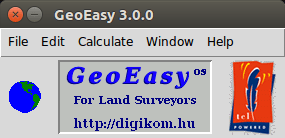

	Main window

Another window is opened for the calculation results. It has dual function
besides the results it has some logging role.

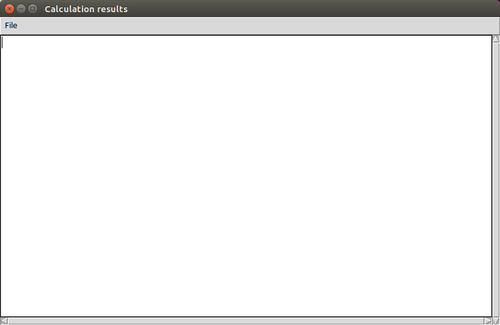

	Calculation results window

Loading sample data set
-----------------------

In the main window select **File/Load...** from the menu. Navigate to the
*demodata* folder and select *test1.geo*. A log message appears in the
*Calculation results* window, that data have been loaded.

View and edit fieldbooks
------------------------

The loaded fieldbooks can be opened in a window. Select
**Edit/Observation** from the menu of the main window. In a cascading menu
the name of the loaded datasets popup, in this case only *test1* is visible,
select it. Fieldbook data are displayed in the default mask type.

.. note:: The mask name is used for dialog boxes containg tabular data. This comes from the display masks which were used on old Leica instruments.

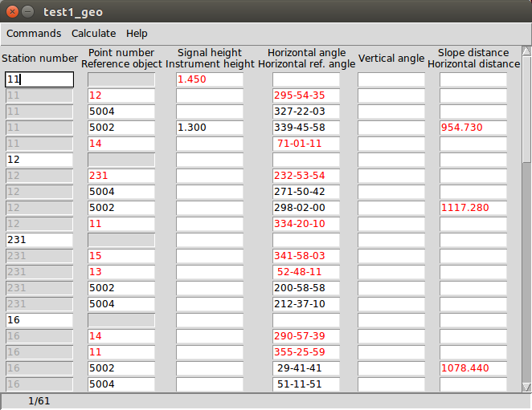

	Fieldbook data

Data are arranged in a table, a row contains station or observed point data.
Column header can contain more labels (e.g. Signal height and Instrument
height). The color of the values in the cells can be different, if more
header lines are present, for example signal heights
are black, instrument heights are red. Colors can be customized in the
**File/Colors...** menu from the main window.

You can move in the table using the right side scroll bar, up and down arrow
keys, mouse wheel (Windows only), TAB/PgUp/PgDn/Ctrl-PgUp/Ctrl-PgDn keys.
You can edit the content of the active field, inside the field
Home/End/Backspace/Delete/Insert keys can be used. If the edited value is not
valid (e.g. non-numeric value in the distance field) an error message
appear and you can not leave the field until the field value is invalid.

View and edit coordinate lists
------------------------------

The loaded coordinate lists can also be opened in a window. Select
**Edit/Coordinates** from the menu of the main window. In a cascading menu
the name of the loaded datasets popup, in this case only *test1* is visible,
select it. Coordinate data are displayed in the default mask type.
Points are ordered in the table by point IDs.

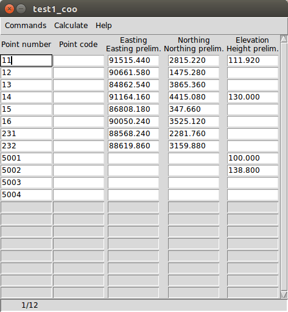

	Coordinate data

Data are arranged in a table, a row contains coordinates of a point.
Column header can contain more labels (e.g. Easting and Easting prelim.)
The color of the values in the cells can be different, eastings
are black, prelimanary eastings are red. Colors can be customized in the
**File/Colors...** menu from the main window.

Field values can be edited in the same way asi in fieldbooks.
The default mask for fieldbooks and coordanate lists can be configured in the
*geo_easy.msk* file (*geoMaskDefault* and *cooMaskDefault* variables)

Graphic window
--------------

Points having horizontal coordinates from all loaded data sets are displayed in
graphic window. Select **Window/New graphic window** from the menu of the main
window or press F11 key to open a new graphic window.

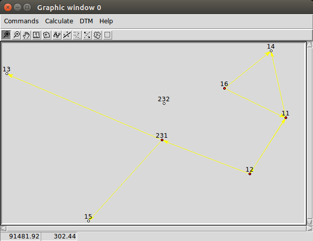

	Graphic window

Enlarge the size of the graphic window, drag the corner of the window by the
mouse and press F3 to zoom to extent. Point symbols, IDs and observations are
visible in the graphic window. Red filled circles are stations but not oriented yet.

Preliminary coordinates
-----------------------

Let's calculate preliminary coordinates for those points which have no
coordinates sofar. Select **Calculate/Preliminary coordinates** from the menu
of any window.  You'll get a message, that there are no elevations for
some points.
Several points will be added to the graphic window and the
coordinate list. They have red point IDs to mark  preliminary coordinates.
Preliminary orientations and elevations are also calculated.

Press F5 button to turn off detail points, having a less crouded view in the
graphic window (or **Commands/Detail points** from the menu of the graphic
window).

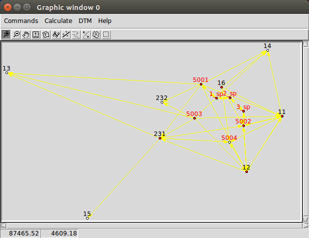

	Graphic window detail points turned out

.. note:: Detail points are selected by the program bythe following rules.  A detail point has a numeric ID and has only one polar observation and was not station.

Calculations
------------

The calculation results are listed in the *Calculation results* window, if
you have closed it, open it **Window/Log window** from the menu of the main
window.  Calculation results are stored in a log file (*geo_easy.log* in the
installation directory), so you can review them later.
There are calculations for a single point and multiple points. Single point
calculations are available from the popup menu, right click on the point in
the graphic window or in the row of the point int the coordinate list window
or in the fieldbook window.
Multi point calculations are available from the *Calculation** menu of any
window.

Whole circle bearing and distance
~~~~~~~~~~~~~~~~~~~~~~~~~~~~~~~~~

Let's calculate the whole circle bearing and distance between points 231 and 13.
Click on the point *231* with the right mouse button in the graphic window and
select **Bearing/Distance** from the popup menu. A selection list is displayed
with the point IDs having coordinates. You can select one or more point to
calculate bearing and distance. Select *13* from the list. The calculation
result is visible in the *Calculation results* window and the status bar of
the graphic window.

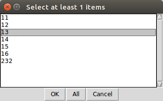

	Point selection box

::

	2017.11.26 09:22 - Bearing/Distance
	Point num  Point num  Bearing   Distance Slope dis Zenith angle
	231        13         293-08-21 4029.889

The slope distance and the zenith angle are calculated only if the elevations of
the points are known.

.. note::

	You can use the right mouse button in the fieldbook or
	coordinate list windows, too. Right click on the point
	ID and select **Calculate**, a cascading menu appear with the
	possible calculations for the point. If you select the
	menu item with the point number an info box will be displayed about the
	point.

Orientation on a station
~~~~~~~~~~~~~~~~~~~~~~~~

Let's calculate orientation for a station *12*. Click on the point *12* with
the right mouse button in the graphic window. Select **Orientation** from the
popup window. A list with the backsight directions are displayed, orientation
angle in the first column and point ID in the second.

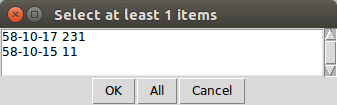

	Backsight selection

Select both points (231, 11), use Shift or/and Ctrl keys to select more lines.
If you would like to select all rows, click on the *All* button.

A weighted average will be calculated for the mean orientation angle, the weights
are the distances. The calculation results are shown in the *Calculation results*
window.

::

	2017.11.26 09:47 - Orientation - 12
	Point num  Code Direction    Bearing   Orient ang   Distance   e" e"max   E(m)
	231             232-53-54   291-04-11    58-10-17   2243.319    0   16    0.010
	11              334-20-10    32-30-25    58-10-15   1588.873   -1   19   -0.010
	Average orientation angle                        58-10-16

The *e\"* column contains the difference from the mean, *e\"(max)* is the
allowable maximal difference (depending on distance), *E(m)* is the linear
difference at the backsight point.

Note that the fill color of the point marker of point *12* became green,
oriented station. The orientation angles and the mean are stored in the
fieldbook, too. Select the orientation mask from the **Commands/Mask...**
in the fieldbook window to see them.

Orientation for all points
~~~~~~~~~~~~~~~~~~~~~~~~~~

You can calculate orientations for all station in a single step, select
**Calculat/Orientations** from the menu of any window. Results are written to
the *Calculation results* window. If the difference from the mean is too large
a warning is displayed. Three other stations are also oriented.

::

	2017.11.26 10:05 - Orientation - 11
	Point num  Code Direction    Bearing   Orient ang   Distance   e" e"max   E(m)
	12              295-54-35   212-30-25   276-35-50   1588.873    1   19    0.010
	14               71-01-11   347-36-58   276-35-47   1637.971   -1   18   -0.010
	Average orientation angle                       276-35-48

::

	2017.11.26 10:05 - Orientation - 231
	Point num  Code Direction    Bearing   Orient ang   Distance   e" e"max   E(m)
	15              341-58-03   222-18-10   240-20-07   2615.063   -1   14   -0.023
	13               52-48-11   293-08-21   240-20-10   4029.889    1   11    0.023
	Average orientation angle                       240-20-08

::

	2017.11.26 10:05 - Orientation - 16
	Point num  Code Direction    Bearing   Orient ang   Distance   e" e"max   E(m)
	14              290-57-39    51-22-38   120-24-59   1425.779   -2   20   -0.016
	11              355-25-59   115-51-02   120-25-03   1628.118    2   18    0.016
	Average orientation angle                       120-25-01

.. note::

	Orientation angles are stored in the fieldbook, you can see them if
	you select *orientation* template (mask). The calculated orientation angles
	will overwrite the previous values.

Intersection
~~~~~~~~~~~~

Let's calculate the coordinates of point *5004* using intersection. Four
directions were measured from point *11, 12, 231* and *16* to *5004*.
Stations have to be oriented to be used in intersection.
Right mouse button click on point *5004* in the graphic window and select
**Intersection** from the popup menu. A list of possible intersection
directions are displayed in the selection window. The fieldbook name and the
point numbers are shown in the list (if more fieldbooks are loaded, stations
from any fieldbook can be used).
Select two directions *11* and *12* (best intersection angle).

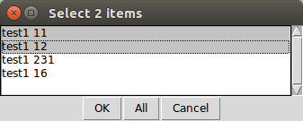

	Intersection point selection

There are two columns in the list window. The first column refers to the
dataset name, the secont column contains point numbers.

.. note::

	This selection dialog is used at several places in the user interface.
	Check the header of the selection window, how many lines should be selected.

::

	2017.11.26 10:23 - Intersection
	Point num  Code                E            N     Bearing
	11                       91515.440     2815.220   243-57-51
	12                       90661.580     1475.280   330-00-58
	5004                     90246.207     2195.193

Note the color of point number is changed in the graphic window from red to
black after calculation done.

.. note::

	You can repeat the intersection calculation selecting different
	direction. The last calculated coordinates are stored only
	in the coordinate list. Previous coordinates will be overwritten.

Resection
~~~~~~~~~

Let's calculate the coordinates of point *5003* in demo data set using resection.
There are six possible directions for resection. Let's find the best
geometry, 120 degree between directions at 5003, in the graphic window.
Right mouse button click on point *5003* in the graphic window and select
**Resection** from the popup menu. A list of possible resection
directions are displayed in the selection window. The fieldbook name and the
point numbers are shown in the list.

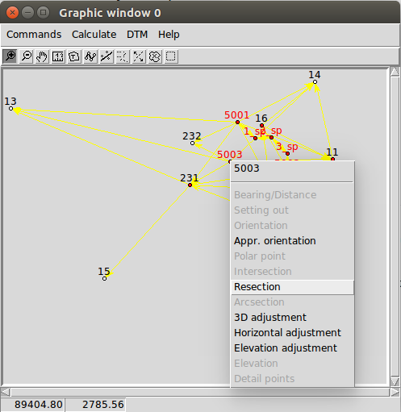

	Resection from the popup menu

Point 12, 13 and 14 look optimal.

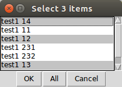

	Resection point selection

::

	2018.01.20 11:26 - Resection
	Point num  Code                E            N      Direction  Angle
	14                       91164.160     4415.080     99-10-24  88-42-37
	12                       90661.580     1475.280    187-53-01 147-41-20
	13                       84862.540     3865.360    335-34-21
	5003                     89398.550     2775.210

.. note::

	You can repeat the resection calculation selecting different
	direction. The last calculated coordinates are stored only
	in the coordinate list. Previous coordinates will be overwritten.

Arcsection
~~~~~~~~~~

Let's calculate the coordinates of point *5002* using arcsection.
There are three measured distances from *5002* to *11*, *12* and *16*.
Right mouse button click on point *5003* in the graphic window and select
**Arcsection** from the popup menu. A list of possible arcsection
directions are displayed in the selection window. The fieldbook name and the
point numbers are shown in the list.

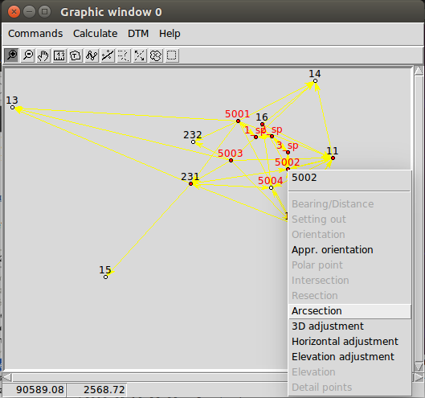

	Arcsection from the popup menu

Let's use the distance from point 11 and 12.

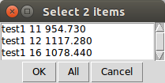

	Arcsection point selection

::

	2018.01.20 12:01 - Arcsection
	Point num  Code              E            N        Distance
	11                       91515.440     2815.220     954.730
	12                       90661.580     1475.280    1117.280
	5002                     90587.628     2590.110

.. note::

	Using arcsection there are two solution (two intersection of the two
	circles). If there are more observations for the point to be calculated,
	GeoEasy can choose the right solution as this case a third distance.
	Otherwise theuser have to select from the two possible solutions.

.. note::

	You can repeat the arcsection calculation selecting different
	distances. The last calculated coordinates are stored only
	in the coordinate list. Previous coordinates will be overwritten.

Elevation calculation
~~~~~~~~~~~~~~~~~~~~~

Let's calculate the elvation of point 5003.
Right mouse button click on point *5003* in the graphic window and select
**Elevation** from the popup menu. A list of possible elevation
calculations are displayed in the selection window. The point name, the
elevation and the distance are shown in the list.

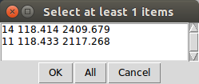

	Elevation point selection

Let's select both rows. The elevation will be calculated as a weighted
average. The weight is inverse propotional of the distance square.

::

	2018.01.20 20:30 - Elevation
	Point num  Code            Height      Distance
	14                        118.414      2409.679
	11                        118.433      2117.268

	5003                      118.425

.. note::

	You can repeat the elevation calculation selecting different
	points. The last calculated elevation is stored only
	in the coordinate list. Previous elevation will be overwritten.

Travese and trigonometric line
~~~~~~~~~~~~~~~~~~~~~~~~~~~~~~

There is a traversing line with three internal points (1_sp, 2_sp, 3_sp)
between point *5001* and *5002*. Let's use the 6th toolbar icon to specify
the traversing line. Click on the first point (*5001*) and the three
internal points using the traversing tool and double click on the last point
(*5002*). A black line is draw asyou click on points.

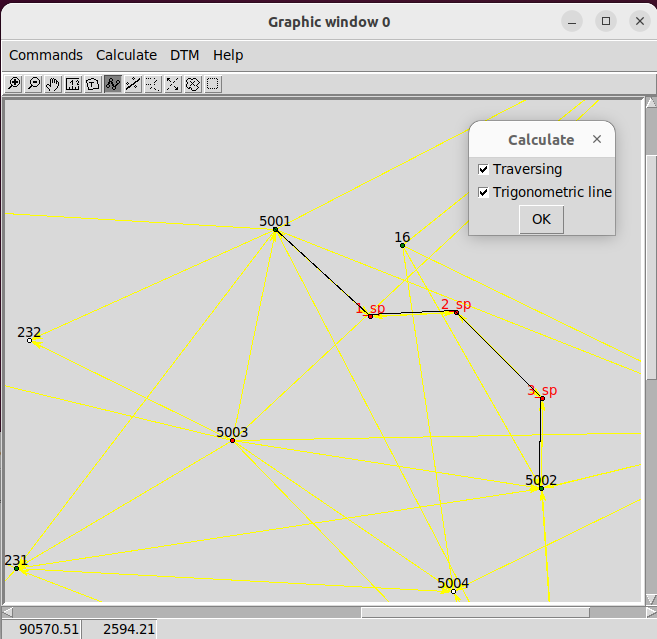

	Travesing line selection

This is an open traversing with orientation on both known endpoints.
A small dialog is shown where you can select the calculaton task.
Travesing to calculate horizontal coordinates and/or Triginometric line
to calculate elevations.

::

	2018.01.20 21:11 - Traversing Open, two orientation
				bearing    bw dist
	Point        angle     distance  (dE)     (dN)       dE         dN
			   correction  fw dist    corrections      Easting    Northing
				  0-00-00        -
	5001        132-34-52
			   -  0-00-05                             89562.512   3587.544
				132-34-47        -
	1_sp        134-23-17  498.890  367.351 -337.557    367.369   -337.521
			   -  0-00-05        -    0.018    0.035  89929.881   3250.023
				 86-57-59        -
	2_sp        228-16-31  330.610  330.147   17.496    330.159     17.520
			   -  0-00-05        -    0.012    0.023  90260.040   3267.542
				135-14-25        -
	3_sp        225-08-37  468.460  329.859 -332.637    329.876   -332.604
			   -  0-00-06        -    0.017    0.033  90589.916   2934.938
				180-22-56        -
	5002        359-37-10  344.860   -2.301 -344.852     -2.288   -344.828
			   -  0-00-06        -    0.012    0.024  90587.628   2590.110

				  0-00-00                              1025.116   -997.434
			   1080-00-27 1642.820 1025.056 -997.550
				720-00-00
			   -  0-00-27             0.060    0.116
										 0.130

	Error limits                 Angle (sec)   Distance (cm)
	Main, precise traversing         50        30
	Precise traversing               65        38
	Main traversing                  67        51
	Traversing                       85        63
	Rural main traversing            87        71
	Rural traversing                105        89

	2018.01.20 21:11 - Trigonometrical line
						   Height differences
	Point    Distance   Foward Backward    Mean  Correction Elevation

	5001                                                     100.000
				498.879   23.947        -   23.947   -0.010
	1_sp                                                     123.938
				330.623    0.307        -    0.307   -0.004
	2_sp                                                     124.240
				468.449   12.661        -   12.661   -0.008
	3_sp                                                     136.893
				344.836    1.926        -    1.926   -0.005
	5002                                                     138.815

			   1642.787                     38.842   -0.027   38.815

	Error limit:   0.118

.. note::

	Orientations on all stations were calculated previously.
	Orientation have to be calculated before traversing calculation.

	You can start traversing calculation from the **Calculation/Traversing**
	menu. That case the tranversing points are selected from lists.

Detail points
~~~~~~~~~~~~~

Some polar detail points were measured from the traversing points. Let's
calculate the coordinates for those points. The fastest way to get the
coordinates of detail points is to select **Calculation/New detail points** from the menu.
It will calculate orientation angle automatically if neccessary.

::

	2018.01.28 13:30 - New detail points
														    Oriented   Horizontal
	Point num  Code      E         N           H   Station  direction  distance
	101              89817.597  3124.363   125.301 1_sp     221-46-38  168.468
	102              89888.171  3112.673   126.819 1_sp     196-52-41  143.505
	103              90043.330  3181.366   126.988 1_sp     121-09-42  132.631
	201              90257.647  3134.405   124.353 2_sp     181-00-54  133.142
	202              90112.941  3206.373   120.740 2_sp     247-25-17  159.272
	301              90543.529  2842.469   139.235 3_sp     206-38-02  103.440
	302              90467.005  2904.622   137.424 3_sp     256-08-41  126.578
	303              90443.170  2958.505   139.836 3_sp     279-07-35  148.611

.. note::
	You can recalculate all detail points after editing the observation data using
	**Calculate/All detailpoints**, you may need to recalculate orientation, too.
	You can recalculate station by station, right click in the graphic window on a
	station and select **Detail points** from the popup menu.

Calculation distances and areas
-------------------------------

The sum of the horizontal distances between points having coordinates can be
calculated in the graphic window using the rules tool from the toolbar (4th
icon). Click on the point marker of the first point and the further point.
Finally double click on the last point. A report is sent to *Calculation
results* window.

::

	2018.02.24 09:11 - Distance calculation
	Point num          E            N         Length
	5001          89562.447     3587.503
	1_sp          89929.837     3249.997      498.885
	2_sp          90260.005     3267.527      330.633
	3_sp          90589.899     2934.934      468.453
	5002          90587.624     2590.112      344.830

	Sum                                      1642.801

The sum of the distances is shown in the status line of the graphic window, too.

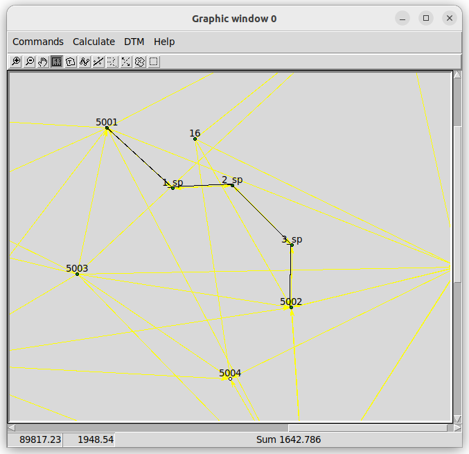

	Distance calculation

The next icon, right to the distance calculation is the area calculation.
It works similar to the distance calculation. Click on the points of the 
polygon and double click on the last point (you needn't to click on the
first point finally). The calculation result are reported in the 
*Calculation result* window.

::

	2018.02.24 09:18 - Area calculation
	Point num          E            N         Length
	5003          89398.545     2775.181
	5001          89562.447     3587.503      828.693
	1_sp          89929.837     3249.997      498.885
	2_sp          90260.005     3267.527      330.633
	3_sp          90589.899     2934.934      468.453
	5002          90587.624     2590.112      344.830
	5003          89398.545     2775.181     1203.396

	Area                                   680295.78817
	Kerület                                  3674.889

.. note::

	The distance and area calculation is available from the **Calculation** menu.
	That case the points are selected from lists.

Coordinate transformation
-------------------------

During a GeoEasy session all points have to be in the same coordinate
reference system (CRS). Coordinates can be converted between two CRSs if
there are common points in the two system. Two GeoEasy data sets have to be 
used. The source dataset is opened and select **Calculation/Coordinate 
transformation** from the menu. The target dataset have to be selected next.
Select *test1_trafo.geo* from the *demodata* folder.

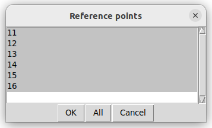

	Common points for transformation

Select all point and press OK button. In the next dialog box the transformation
type is selected.

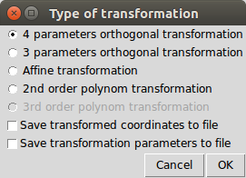

	Transfomation options

Pressing the OK button the transformation parameters are calculated using the
least squares method. In the *Calculation results* window three blocks of
information is displayed.

::

	2018.02.24 12:09 - 4 parameters orthogonal transformation test1 -> test_trafo
	E = 561684.477 + e * 0.999997669 - n * -0.000003434
	N = 246411.178 + e * -0.000003434 + n * 0.999997669

	  Scale = 0.99999767 Rotation = -  0-00-01

	  Point num     e          n            E            N        dE      dN      dist
	  11       91515.440   2815.220   653199.720   249226.070   -0.007   0.007   0.010
	  12       90661.580   1475.280   652345.850   247886.150    0.001  -0.007   0.007
	  13       84862.540   3865.360   646546.830   250276.240    0.002  -0.003   0.004
	  14       91164.160   4415.080   652848.440   250825.940   -0.001  -0.006   0.006
	  15       86808.180    347.660   648492.460   246758.540   -0.004  -0.001   0.005
	  16       90050.240   3525.120   651734.510   249935.970    0.009   0.010   0.014

	  RMS= 0.008

	  Point num     e            n            E            N
	  231      88568.240   2281.760   650252.518   248692.628
	  232      88619.860   3159.880   650304.141   249570.746

In the first block the formula of the transformation is given. The second blok contains 
the common points coordinates and the errors. In the third block the transformated
coordinates are given, those points can be found here which have coodinates in
thesource dataset but not in the taget dataset.

.. note::

	If the transformation parameters are known use the **Commands/Transformation** 
	or **Commands/Transformation, parameters from file** from the menu of
	the coordinate list window.

Save to DXF file
----------------

The points with horizontal coordinates from all loaded datasets can be
exported into a DXF file. Select **Commands/DXF output** from the
menu of the graphic window. In the displayed dialog box several
options can be set for the DXF file.

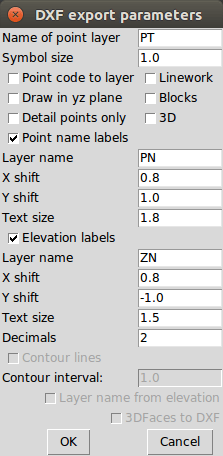

	DXF options

The point symbol (AutoCAD point entities), the point ID and the elevation 
can be exported to the output. The last block is available if a DTM is
loaded.

Digital terrain model
---------------------

GeoEasy is capable to create TIN based Digital Terrain Models from the point
in the loaded datasets or from a DXF file. There is a small electric field
book in the demo data set called *terrain.scr*. Load the *scr* file using
the **File/Load...** menu of the main window.

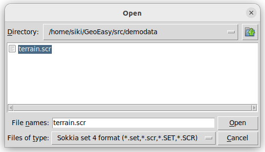

	Loading field book

There are 77 points in the coordinate list, let's open a graphic window to see
the points and turn off the the yellow observation lines and point name
labels using the **Commands/Observations F4** and **Commands/Point names**
from the menu of the graphic window.

.. note::

	In the calculation results window you can see a table with collimation
	and index errors. If the observations were made in two faces, 
	the average of face left and face right will be stored in the
	field-book.

.. note::

	The colors used in the graphics window can be changed using
	**File/Colors...** from the menu of the main window.

Let's start to creat a TIN, select **DTM/Create...** from the menu of the 
graphic window and press OK button in the *Create DTM* dialog and select
directory and name for the DTM in the *Save as* dialog.

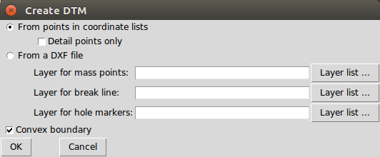

	DTM creation

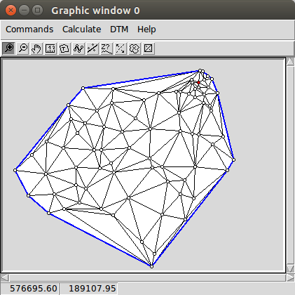

	TIN in the graphic window

The convex hole of the points is filled by triangles which have  minimal
sum of perimeters. At the side of the model there are narrow triangles.
These can be avoided by defining a non-convex boundary for the modell.
Unload the TIN by **DTM/Close** from the menu of graphic window. Using the
Break line tool from the toolbar draw the boundary of the model.

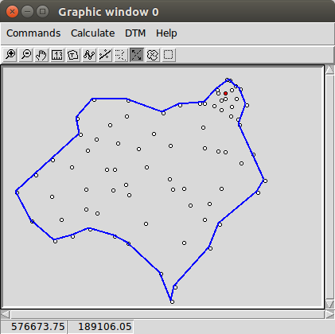

	Non-convex boundary for TIN

Select again the **DTM/Create...** from the menu and unselect convex
boundary checkbox. Triangles are created inside the closed polyline.

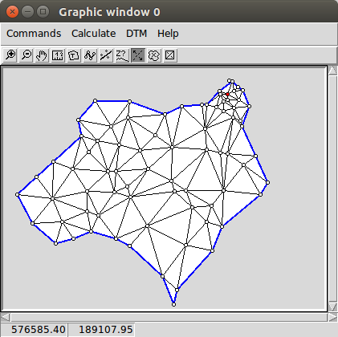

	Non-convex boundary for TIN

.. note::

	Break lines can be added, those can be open polylines. If convex
	boundary is unchecked at least one closed polyline must be added
	to the model.

Let's add contours to our model, **DTM/Contours** from the menu. Input 1 (meter)
for contour interval. Finally export contours to an AutoCAD DXF file using
**Commands/DXF output**.

.. figure:: images/contour_dxf.png
	:align: center

	Contours in LibreCAD

.. note::

	TINs are stored in three ASCII files (.pnt for points, .dtm for triangles
	and .pol for break lines).

Regression calculation
----------------------

Regression calculation can be used to find best fitting geometrical shape to the 
calculated coordinates. A least square adjustment is used to find the parameters 
of the best fitting geometry.

Regression line
~~~~~~~~~~~~~~~

Regression plane
~~~~~~~~~~~~~~~~

