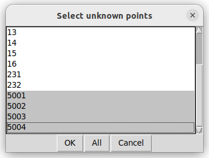
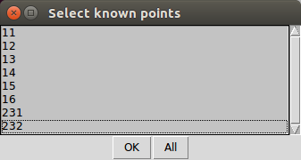
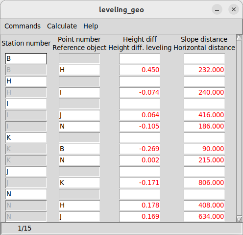
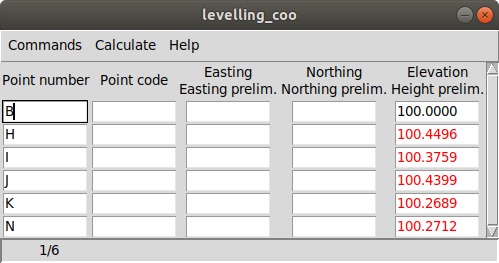
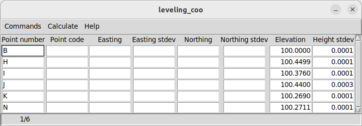
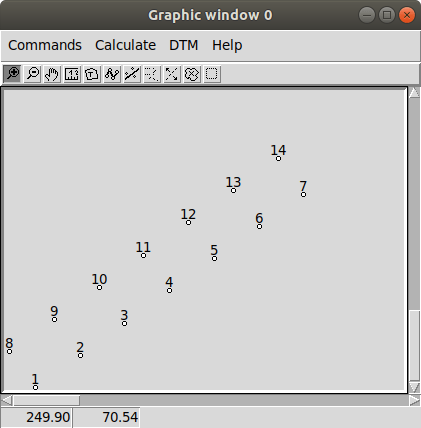

.. header:: GeoEasy Step by Step

GeoEasy 3 Step by Step Tutorial
===============================

:Authors:
	Zoltan Siki siki1958 (at) gmail (dot) com

.. note:: This training material does not extend to the use of the program in every detail, further information can be found in other documentation files.

.. contents:: Table of Contents

Introduction
------------

The installation kit contains a *demodata* directory. In this guide the data
files from the *demodata* directory will be used.

Images in this tutorial are generated on an Ubuntu box. Window layouts on
different operating systems may look different.

After starting GeoEasy a small windows appears near to the upper left corner
of your monitor. It is the main window with a menu and a rotating Earth.
If the rotation stopped the software is busy, user have to wait.

.. figure:: images/main_window.png
	:align: center

	Main window

Another window is opened for the calculation results. It has dual function
besides the results it has some logging role.

.. figure:: images/results.png
	:align: center

	Calculation results window

Loading sample data set
-----------------------

In the main window select **File/Load...** from the menu. Navigate to the
*demodata* folder and select *test1.geo*. A log message appears in the
*Calculation results* window, that data have been loaded.

View and edit field-books
-------------------------

The loaded field-books can be opened in a window. Select
**Edit/Observation** from the menu of the main window. In a cascading menu
the name of the loaded data sets popup, in this case only *test1* is visible,
select it. Field-book data are displayed in the default mask type.

.. note:: *The mask name is used for dialog boxes containing tabular data. This comes from the display masks which were used on old Leica instruments.*

.. figure:: images/fieldbook.png
	:align: center

	Fieldbook data

Data are arranged in a table, a row contains station or observed point data.
Column header can contain more labels (e.g. Signal height and Instrument
height). The color of the values in the cells can be different, if more
header lines are present, for example signal heights
are black, instrument heights are red. Colors can be customized in the
**File/Colors...** menu from the main window.

You can move in the table using the right side scroll bar, up and down arrow
keys, mouse wheel (Windows only), **TAB/PgUp/PgDn/Ctrl-PgUp/Ctrl-PgDn** keys.
You can edit the content of the active field, inside the field
**Home/End/Backspace/Delete/Insert** and arrow keys can be used. 
If the edited value is not
valid (e.g. non-numeric value in the distance field) an error message
appear and you can not leave the field until the field value is invalid.

View and edit coordinate lists
------------------------------

The loaded coordinate lists can also be opened in a window. Select
**Edit/Coordinates** from the menu of the main window. In a cascading menu
the name of the loaded data sets popup, in this case only *test1* is visible,
select it. Coordinate data are displayed in the default mask type.
Points are ordered in the table by point IDs.

.. figure:: images/coordinate.png
	:align: center

	Coordinate data

Data are arranged in a table, a row contains coordinates of a point.
Column header can contain more labels (e.g. Easting and Easting prelim.)
The color of the values in the cells can be different, eastings
are black, preliminary eastings are red. Colors can be customized in the
**File/Colors...** menu from the main window.

Field values can be edited in the same way as in field-books.
The default mask for field-books and coordinate lists can be configured in the
*geo_easy.msk* file (*geoMaskDefault* and *cooMaskDefault* variables)

Graphic window
--------------

Points having horizontal coordinates from all loaded data sets are displayed in
graphic window. Select **Window/New graphic window** from the menu of the main
window or press F11 key to open a new graphic window.

.. figure:: images/graphic.png
	:align: center

	Graphic window

Enlarge the size of the graphic window, drag the corner of the window by the
mouse and press F3 to zoom to extent. Point symbols, IDs and observations are
visible in the graphic window. Red filled circles are stations but not oriented yet.

Preliminary coordinates
-----------------------

Let's calculate preliminary coordinates for those points which have no
coordinates so far. Select **Calculate/Preliminary coordinates** from the menu
of any window.  You'll get a message, that there are no elevations for
some points.
Several points will be added to the graphic window and the
coordinate list. They have red point IDs to mark  preliminary coordinates.
Preliminary orientations and elevations are also calculated.

Press F5 button to turn off detail points, having a less crowded view in the
graphic window (or **Commands/Detail points** from the menu of the graphic
window).

.. figure:: images/graphic1.png
	:align: center

	Graphic window detail points turned out

.. note:: Detail points are selected by the program using the following rules.  A detail point has a numeric ID and has only one polar observation and was not station.

Calculations
------------

The calculation results are listed in the *Calculation results* window, if
you have closed it, open it **Window/Log window** from the menu of the main
window.  Calculation results are stored in a log file (*geo_easy.log* in the
user's home directory), so you can review them later.
There are calculations for a single point and multiple points. Single point
calculations are available from the popup menu, right click on the point in
the graphic window or in the row of the point in the coordinate list window
or in the field-book window.
Multi point calculations are available from the **Calculation** menu of any
window.

Whole circle bearing and distance
~~~~~~~~~~~~~~~~~~~~~~~~~~~~~~~~~

Let's calculate the whole circle bearing and distance between points 231 and 13.
Click on the point *231* with the right mouse button in the graphic window and
select **Bearing/Distance** from the popup menu. A selection list is displayed
with the point IDs having coordinates. You can select one or more point to
calculate bearing and distance. Select *13* from the list. The calculation
result is visible in the *Calculation results* window and in the status bar of
the graphic window.

.. figure:: images/sel_point.png
	:align: center

	Point selection box (window header gives hint how many rows to select)

::

    2023.10.21 23:01 - Bearing/Distance
    Point num  Point num    Bearing   Distance Slope dis Zenith angle
    231        13           293-08-21 4029.889

The slope distance and the zenith angle are calculated only if the elevations of
the points are known.

.. note::

	*You can use the right mouse button in the field-book or
	coordinate list windows, too. Right click on the point
	ID and select* **Calculate**, *a cascading menu appears with the
	possible calculations for the point. If you select the
	menu item with the point ID an info box will be displayed about the
	point.*

Orientation on a station
~~~~~~~~~~~~~~~~~~~~~~~~

Let's calculate orientation for station *12*. Click on the point *12* with
the right mouse button in the graphic window. Select **Orientation** from the
popup window. A list with the back-sight directions are displayed, orientation
angle in the first column and point ID in the second.

.. figure:: images/ori_list.png
	:align: center

	Backsight selection

Select both points (231, 11), use *Shift* or/and *Ctrl* keys to select more lines.
If you would like to select all rows, click on the *All* button.

A weighted average will be calculated for the mean orientation angle, the weights
are the distances. The calculation results are shown in the *Calculation results*
window.

::

    2023.10.21 23:12 - Orientation - 12
    Point num  Code         Direction    Bearing   Orient ang   Distance   e" e"max   E(m)
    231                     232-53-54   291-04-11    58-10-17   2243.319    0   16    0.010
    11                      334-20-10    32-30-25    58-10-15   1588.873   -1   19   -0.010
    Average orientation angle                        58-10-16

The *e\"* column contains the difference from the mean, *e\"(max)* is the
allowable maximal difference (depending on distance), *E(m)* is the linear
difference at the back-sight point.

Note that the fill color of the point marker of point *12* became green,
oriented station.
The orientation angles and the mean are stored in the
field-book, too.
Select the *orientation* mask from the **Commands/Mask...**
in the field-book window to see them.

Orientation for all points
~~~~~~~~~~~~~~~~~~~~~~~~~~

You can calculate orientations for all station in a single step, select
**Calculate/Orientations** from the menu of any window. Results are written to
the *Calculation results* window. If the difference from the mean is too large
a warning is displayed. The three other unoriented stations are also oriented.

::

    2023.10.22 11:22 - Orientation - 11
    Point num  Code         Direction    Bearing   Orient ang   Distance   e" e"max   E(m)
    12                      295-54-35   212-30-25   276-35-50   1588.873    1   19    0.010
    14                       71-01-11   347-36-58   276-35-47   1637.971   -1   18   -0.010
    Average orientation angle                       276-35-48

    2023.10.22 11:22 - Orientation - 231
    Point num  Code         Direction    Bearing   Orient ang   Distance   e" e"max   E(m)
    15                      341-58-03   222-18-10   240-20-07   2615.063   -1   14   -0.023
    13                       52-48-11   293-08-21   240-20-10   4029.889    1   11    0.023
    Average orientation angle                       240-20-08

    2023.10.22 11:22 - Orientation - 16
    Point num  Code         Direction    Bearing   Orient ang   Distance   e" e"max   E(m)
    14                      290-57-39    51-22-38   120-24-59   1425.779   -2   20   -0.016
    11                      355-25-59   115-51-02   120-25-03   1628.118    2   18    0.016
    Average orientation angle                       120-25-01

.. note::

    *Orientation angles are stored in the field-book, you can see them if
    you select orientation template (mask).
    Select the orientation mask from the* **Commands/Mask...** 
    *in the field-book window to see them.
    The calculated orientation angles will overwrite the previous values.*

Intersection
~~~~~~~~~~~~

Let's calculate the coordinates of point *5004* using intersection. Four
directions were measured from point *11, 12, 231* and *16* to *5004*.
Stations have to be oriented to be used in intersection.
Right mouse button click on point *5004* in the graphic window and select
**Intersection** from the popup menu. A list of possible intersection
directions are displayed in the selection window. The field-book name and the
point numbers are shown in the list (if more field-books are loaded, stations
from any field-book can be used).
Select two directions *11* and *12* (best intersection angle).

.. figure:: images/intersection.png
	:align: center

	Intersection point selection

There are two columns in the list window. The first column refers to the
data set names, the second column contains point numbers.

.. note::

	This selection dialog is used at several places in the user interface.
	Check the header of the selection window, how many lines should be selected.

::

    2023.10.22 11:30 - Intersection
    Point num  Code              E            N       Bearing
    11                       91515.440     2815.220   243-57-51
    12                       90661.580     1475.280   330-00-58
    5004                     90246.207     2195.193

Note the color of point number is changed in the graphic window from red to
black after calculation done.

.. note::

	You can repeat the intersection calculation selecting different
	directions. The last calculated coordinates are stored only
	in the coordinate list. Previous coordinates will be overwritten.

Resection
~~~~~~~~~

Let's calculate the coordinates of point *5003* in demo data set using resection.
There are six possible directions for resection. Let's find the best
geometry, 120 degree between directions at 5003.
Point 12, 13 and 14 look optimal.
Right mouse button click on point *5003* in the graphic window and select
**Resection** from the popup menu. A list of possible resection
directions are displayed in the selection window. The field-book name and the
point numbers are shown in the list.

.. figure:: images/resection_menu.png
	:align: center

	Resection from the popup menu

.. figure:: images/resection.png
	:align: center

	Resection point selection

::

    2023.10.22 11:35 - Resection
    Point num  Code              E            N        Direction  Angle
    14                       91164.160     4415.080     99-10-24    88-42-37
    12                       90661.580     1475.280    187-53-01   147-41-20
    13                       84862.540     3865.360    335-34-21
    5003                     89398.550     2775.210

.. note::

	You can repeat the resection calculation selecting different
	direction. The last calculated coordinates are stored only
	in the coordinate list. Previous coordinates will be overwritten.

Arcsection
~~~~~~~~~~

Let's calculate the coordinates of point *5002* using arcsection.
There are three measured distances from *5002* to *11*, *12* and *16*.
Right mouse button click on point *5003* in the graphic window and select
**Arcsection** from the popup menu. A list of possible arcsection
directions are displayed in the selection window. The field-book name and the
point numbers are shown in the list.

.. figure:: images/arcsection_menu.png
	:align: center

	Arcsection from the popup menu

Let's use the distance from point 11 and 12.

.. figure:: images/arcsection.png
	:align: center

	Arcsection point selection

::

    2023.10.22 11:41 - Arcsection
    Point num  Code              E            N        Distance
    11                       91515.440     2815.220     954.730
    12                       90661.580     1475.280    1117.280
    5002                     90587.628     2590.110

.. note::

	Using arcsection there are two solution (two intersections of the two
	circles). If there are more observations for the point to be calculated,
	GeoEasy can choose the right solution as this case a third distance.
	Otherwise the user have to select from the two possible solutions.

.. note::

	You can repeat the arcsection calculation selecting different
	distances. The last calculated coordinates are stored only
	in the coordinate list. Previous coordinates will be overwritten.

Elevation calculation
~~~~~~~~~~~~~~~~~~~~~

Let's calculate the elevation of point 5003.
Right mouse button click on point *5003* in the graphic window and select
**Elevation** from the popup menu. A list of possible elevation
calculations are displayed in the selection window. The point name, the
elevation and the distance are shown in the list.

.. figure:: images/elevation.png
	:align: center

	Elevation point selection

Let's select both rows. The elevation will be calculated as a weighted
average. The weight is inverse proportional of the distance square.

::

    2023.10.22 11:43 - Elevation
    Point num  Code            Height      Distance
    14                        118.414      2409.679
    11                        118.433      2117.268

    5003                      118.425

.. note::

	You can repeat the elevation calculation selecting different
	points. The last calculated elevation is stored only
	in the coordinate list. Previous elevation will be overwritten.

Traverse and trigonometric line
~~~~~~~~~~~~~~~~~~~~~~~~~~~~~~~

There is a traversing line with three internal points (1_sp, 2_sp, 3_sp)
between point *5001* and *5002*.

.. note::

    Before you start traversing please make sure the start and end
    point of the travese line have final coordinates (in black) in
    the coordinate list and are oriented (green circle).
    You can use resection for 5001, and intersection for 5002 if necessary.

Let's use the 6th toolbar icon to specify
the traversing line. Click on the first point (*5001*) and the three
internal points using the traversing tool and double click on the last point
(*5002*). A black line is draw as you click on points.

.. figure:: images/traversing.png
	:align: center

	Traversing line selection

This is an open traversing with orientation on both known endpoints.
A small dialog is shown where you can select the calculation task.
Traversing to calculate horizontal coordinates and/or Trigonometric line
to calculate elevations.

::

    2023.10.22 11:59 - Traversing Open, two orientation
                bearing    bw dist
    Point        angle     distance  (dE)     (dN)       dE         dN
               correction  fw dist    corrections      Easting    Northing
                   0-00-00        -
    5001         132-34-50
                -  0-00-05                             89562.497   3587.526
                 132-34-45        -
    1_sp         134-23-17  498.890  367.354 -337.553    367.374   -337.516
                -  0-00-05        -    0.020    0.038  89929.872   3250.011
                  86-57-57        -
    2_sp         228-16-31  330.610  330.147   17.500    330.160     17.525
                -  0-00-05        -    0.013    0.025  90260.032   3267.535
                 135-14-23        -
    3_sp         225-08-37  468.460  329.862 -332.634    329.881   -332.599
                -  0-00-05        -    0.019    0.035  90589.913   2934.936
                 180-22-55        -
    5002         359-37-10  344.860   -2.299 -344.852     -2.285   -344.826
                -  0-00-05        -    0.014    0.026  90587.628   2590.110

                  0-00-00                              1025.131   -997.416
               1080-00-25 1642.820 1025.064 -997.540
                720-00-00
               -  0-00-25             0.066    0.124
                                          0.140

	Error limits                 Angle (sec)   Distance (cm)
	Main, precise traversing         50        30
	Precise traversing               65        38
	Main traversing                  67        51
	Traversing                       85        63
	Rural main traversing            87        71
	Rural traversing                105        89

::

    2023.10.22 11:59 - Trigonometrical line
                           Height differences
    Point    Distance  Forward Backward    Mean  Correction Elevation

    5001                                                     100.000
                498.879   23.947        -   23.947   -0.015
    1_sp                                                     123.932
                330.625    0.307        -    0.307   -0.007
    2_sp                                                     124.233
                468.448   12.661        -   12.661   -0.013
    3_sp                                                     136.881
                344.834    1.926        -    1.926   -0.007
    5002                                                     138.800

               1642.786                     38.842   -0.042   38.800

    Error limit:   0.118

.. note::

	Orientations on all stations were calculated previously.
	Orientation have to be calculated before traversing calculation.

	You can start traversing calculation from the **Calculation/Traversing**
	menu, too. That case the traversing points are selected from lists.

Detail points
~~~~~~~~~~~~~

Some polar detail points were measured from the traversing points. Let's
calculate the coordinates for those points. The fastest way to get the
coordinates of detail points is to select **Calculation/New detail points** from the menu.
It will calculate orientation angle automatically if necessary.

::

    2023.10.22 12:03 - Orientation - 1_sp
    Point num  Code         Direction    Bearing   Orient ang   Distance   e" e"max   E(m)
    5001                      0-00-06   312-34-28   312-34-22    498.879    1   33    0.003
    2_sp                    134-23-23    86-57-42   312-34-19    330.625   -1   41   -0.003
    Average orientation angle                       312-34-21

    2023.10.22 12:03 - Orientation - 3_sp
    Point num  Code         Direction    Bearing   Orient ang   Distance   e" e"max   E(m)
    2_sp                    278-51-33   315-14-06    36-22-33    468.448   -1   35   -0.003
    5002                    144-00-10   180-22-47    36-22-37    344.834    2   40    0.003
    Average orientation angle                        36-22-35

    2023.10.22 12:03 - Orientation - 2_sp
    Point num  Code         Direction    Bearing   Orient ang   Distance   e" e"max   E(m)
    1_sp                    123-44-51   266-57-42   143-12-51    330.625    3   41    0.006
    3_sp                    352-01-22   135-14-06   143-12-44    468.448   -2   35   -0.006
    Average orientation angle                       143-12-47

    2023.10.22 12:03 - New detail points
                                                                             Oriented   Horizontal
    Point num  Code              E            N              H   Station     direction  distance
    101                      89817.629     3124.380      125.301 1_sp        221-46-44  168.468
    102                      89888.203     3112.688      126.819 1_sp        196-52-47  143.505
    103                      90043.364     3181.377      126.988 1_sp        121-09-48  132.631
    201                      90257.670     3134.414      124.353 2_sp        181-00-59  133.142
    202                      90112.966     3206.386      120.740 2_sp        247-25-22  159.272
    301                      90543.540     2842.474      139.235 3_sp        206-38-08  103.440
    302                      90467.017     2904.628      137.424 3_sp        256-08-47  126.578
    303                      90443.184     2958.512      139.836 3_sp        279-07-41  148.611

.. note::
	You can recalculate all detail points after editing the observation data using
	**Calculate/All detailpoints**, you may need to recalculate orientation, too.
	You can recalculate station by station, right click in the graphic window on a
	station and select **Detail points** from the popup menu.

Calculation distances and areas
-------------------------------

The sum of the horizontal distances between points having coordinates can be
calculated in the graphic window using the ruler tool from the toolbar (4th
icon). Click on the point marker of the first point and the further points.
Finally double click on the last point. A report is sent to *Calculation
results* window.

::

    2023.10.22 12:07 - Distance calculation
    Point num          E            N         Length
    5001          89562.497     3587.526
    1_sp          89929.872     3250.011      498.879
    2_sp          90260.032     3267.535      330.625
    3_sp          90589.913     2934.936      468.448
    5002          90587.628     2590.110      344.834

    Sum                                      1642.786

The sum of the distances is shown in the status line of the graphic window, too.

.. figure:: images/dist.png
	:align: center

	Distance calculation

The next icon, right to the distance calculation is the area calculation.
It works similar to the distance calculation. Click on the points of the 
polygon and double click on the last point (you needn't to click on the
first point finally). The calculation result are reported in the 
*Calculation result* window.

::

    2023.10.22 12:48 - Area calculation
    Point num          E            N         Length
    101           89817.629     3124.380
    102           89888.203     3112.688       71.536
    103           90043.364     3181.377      169.685
    202           90112.966     3206.386       73.959
    201           90257.670     3134.414      161.615
    303           90443.184     2958.512      255.650
    302           90467.017     2904.628       58.919
    301           90543.540     2842.474       98.584
    101           89817.629     3124.380      778.728

    Area                                    78674.14098
    Perimeter                                1668.677
    Mean centre                              90196.697,    3058.107
    Centre of gravity                        90191.093,    3054.207

.. note::

	The distance and area calculation is available from the **Calculation** menu.
	That case the points are selected from lists.

Coordinate transformation
-------------------------

During a GeoEasy session all points have to be in the same coordinate
reference system (CRS) for the calculations.
Coordinates can be converted between two CRSs if
there are common points in the two system. Two GeoEasy data sets have to be 
used. The source data set should be opened and select **Calculation/Coordinate 
transformation** from the menu. The target data set have to be selected next.
Select *test1_trafo.geo* from the *demodata* folder.
A list of the common points width horizontal coordinates in the two data sets is shown.

.. figure:: images/coo_tr.png
	:align: center

	Common points for transformation

Select all points and press OK button. In the next dialog box the transformation
type can be selected.

.. figure:: images/coo_tr2.png
	:align: center

	Transformation options

Pressing the OK button the transformation parameters are calculated using the
least squares method. In the *Calculation results* window three blocks of
information is displayed.

::

    2023.10.22 12:57 - 4 parameters orthogonal transformation test1 -> test_trafo
      E = 561684.477 + e * 0.999997669 - n * -0.000003434
      N = 246411.178 + e * -0.000003434 + n * 0.999997669

      Scale = 0.99999767 Rotation = -  0-00-01

    Point num          e            n            E            N          dE           dN           dist
    11            91515.440     2815.220   653199.720   249226.070       -0.007        0.007      0.010
    12            90661.580     1475.280   652345.850   247886.150        0.001       -0.007      0.007
    13            84862.540     3865.360   646546.830   250276.240        0.002       -0.003      0.004
    14            91164.160     4415.080   652848.440   250825.940       -0.001       -0.006      0.006
    15            86808.180      347.660   648492.460   246758.540       -0.004       -0.001      0.005
    16            90050.240     3525.120   651734.510   249935.970        0.009        0.010      0.014

    RMS= 0.008

    Point num          e            n            E            N
    1_sp          89929.872     3250.011   651614.150   249660.872
    2_sp          90260.032     3267.535   651944.309   249678.395
    3_sp          90589.913     2934.936   652274.189   249345.796
    101           89817.629     3124.380   651501.907   249535.242
    102           89888.203     3112.688   651572.481   249523.550
    103           90043.364     3181.377   651727.642   249592.238
    201           90257.670     3134.414   651941.947   249545.275
    202           90112.966     3206.386   651797.244   249617.247
    231           88568.240     2281.760   650252.518   248692.628
    232           88619.860     3159.880   650304.141   249570.746
    301           90543.540     2842.474   652227.815   249253.334
    302           90467.017     2904.628   652151.293   249315.488
    303           90443.184     2958.512   652127.460   249369.372
    5001          89562.497     3587.526   651246.778   249998.388
    5002          90587.628     2590.110   652271.903   249000.970
    5003          89398.550     2775.210   651082.828   249186.074
    5004          90246.207     2195.193   651930.481   248606.056

In the first block the formula of the transformation is given. The second block
contains the coordinates of common points and the errors. In the third block 
the transformed
coordinates are given, those points can be found here which have coordinates in
the source data set but not in the target data set.

.. note::

	*If the transformation parameters are known use the* **Commands/Transformation** 
	*or* **Commands/Transformation, parameters from file** *from the menu of
	the coordinate list window.*

Save to DXF file
----------------

The points with horizontal coordinates from all loaded data sets can be
exported into a DXF file. Select **Commands/DXF output** from the
menu of the graphic window. After specifying the output DXF file path,
several options can be set for the DXF file in the displayed dialog box.

.. figure:: images/dxf.png
	:align: center

	DXF options

The point symbol (AutoCAD point entities), the point ID and the elevation 
can be exported to the output. The last block is available if a DTM is
loaded.

Horizontal network adjustment
-----------------------------

Let's calculate the coordinates of points 5001, 5002, 5003 and 5004 using all
available observations from points. GeoEasy uses GNU Gama
(https://www.gnu.org/software/gama/) for the network adjustment.

Before adjustment calculation the a priori standard deviations should be set
in the **Calculation parameters** dialog. 3 arc seconds for directions and
3 mm + 3 ppm for distances.

From the **Calculate** menu select **Horizontal network adjustment**. From the
first point list select the unknown points (which coordinates are changed
during adjustment). This list contains all point having preliminary or final
coordinates.

	Unknown points

From the second point list select the fixed points (if no fixed points
selected then free network will be calculated). This list contains point 
with final coordinates.

	Fixed points

The result of the adjustment is shown in the Calculation results window.
During the adjustment statistical tests are calculated to detect blunders
but blunders are not eliminated automatically.

Leveling network adjustment
---------------------------

Leveling data can be loaded from GSI field-books created by digital leveling
instruments (for example Leica DNA03 or NA3000 instruments). Manual input of height differences is also possible.

Let's start with an ASCII file (field-book) which contains start and endpoint,
distance, height difference.

.. code:: text

	B H 232 0.44982
	H I 240 -0.07392
	I J 416 0.06413
	I N 186 -0.10494
	K B 90 -0.26894
	K N 215 0.00234
	J K 806 -0.17131
	N H 408 0.17836
	N J 634 0.1686

Field-book (leveling.dmp file)

Please close all opened data sets.
Let's load this field-book into GeoEasy. Select **File/Load** from the menu of
the main window. Select *Fieldbook (\*.dmp, \*.DMP)* type. The leveling.dmp 
file is in the demodata sub-directory of GeoEasy installation folder. Select the
file and click on Open button. A dialog will be displayed where fields of the
input file can be set. Remove the unnecessary fields (*Horizontal angle, Vertical angle, lope distance, signal height,instrument height*) and add *horizontal
distance* and *Height diff. leveling*. Don't forget to add *space* to the 
separators.

.. figure:: images/dmp_level.png
	:align: center

	Loading leveling.dmp

Open the field-book (**Edit/Observations**) and change the mask (
**Commands/Mask...**) to *leveling*. You can see nine observations.

	Observations in leveling mask

These observations were made by digital leveling instrument with a standard
deviation of 0.3 mm/km. Change calculation parameters (**File/Calculation parameters...**), *Decimals in results* should be changed to 4. Check also 
*Standard deviation for leveling [mm/km]*, it should be 0.7.

We shall adjust this small leveling network.
There are no elevations in the field-book, so first set the elevation of point
*B* to 100.000 (**Commands/New point** from the menu or **F7** button).
After it let's calculate preliminary elevations 
(**Calculations/Preliminary coordinates**)

	Preliminary elevations

Now we can start leveling network adjustment (**Calculate/Leveling network adjustment**). Select all point as unknown. In the calculation result window a
long result list is displayed and the coordinates in the coordinate list are 
updated.

.. code:: text

	Adjusted heights
	****************

  	i        point     approximate  correction  adjusted    std.dev conf.i.
	======================= value ====== [m] ====== value ========== [mm] ===

  	1            B *     100.00000  -0.00002      99.99998     0.1     0.4
	2            H *     100.45000  -0.00013     100.44987     0.2     0.4
	3            I *     100.37600   0.00001     100.37601     0.1     0.4
	4            J *     100.44000   0.00003     100.44003     0.3     0.8
  	5            N *     100.27100   0.00010     100.27110     0.1     0.4
  	6            K *     100.26900   0.00000     100.26900     0.1     0.4

	Adjusted observations
	*********************

   	i   standpoint       target           observed     adjusted std.dev conf.i.
	=========================================== value ==== [m|d] ====== [mm|ss] ==

   	1            B            H h dif      0.45000      0.44989     0.2     0.6
   	2            H            I h dif     -0.07400     -0.07386     0.2     0.6
   	3            I            J h dif      0.06400      0.06402     0.4     1.0
   	4                         N h dif     -0.10500     -0.10492     0.2     0.5
   	5            K            B h dif     -0.26900     -0.26902     0.1     0.3
   	6                         N h dif      0.00200      0.00210     0.2     0.5
   	7            J            K h dif     -0.17100     -0.17103     0.4     1.1
   	8            N            H h dif      0.17800      0.17877     0.2     0.6
   	9                         J h dif      0.16900      0.16894     0.4     1.0

	Adjusted elevations an mean errors in *fix_stdev* mask

Digital terrain model
---------------------

GeoEasy is capable to create TIN based Digital Terrain Models from the points
in the loaded data sets or from a DXF file. *Triangle* open source project is
used to generate triangles.
There is a small electric field
book in the demo data set called *terrain.scr*. Load the *scr* file using
the **File/Load...** menu of the main window.

.. figure:: images/terrain_load.png
	:align: center

	Loading field book

There are 77 points in the coordinate list, let's open a graphic window to see
the points and turn off the the yellow observation lines and point name
labels using the **Commands/Observations F4** and **Commands/Point names**
from the menu of the graphic window.

.. note::

	*In the calculation results window you can see a table with collimation
	and index errors. If the observations were made in two faces, 
	the average of face left and face right will be stored in the
	field-book.*

.. note::

	*The colors used in the graphics window can be changed using*
	**File/Colors...** *from the menu of the main window.*

Let's start to create a TIN, select **DTM/Create...** from the menu of the 
graphic window and press OK button in the *Create DTM* dialog and select
directory and name for the DTM in the *Save as* dialog.

.. figure:: images/create_dtm.png
	:align: center

	DTM creation

.. figure:: images/dtm.png
	:align: center

	TIN in the graphic window

The convex hole of the points is filled by triangles which have  minimal
sum of perimeters. At the side of the model there are narrow triangles.
These can be avoided by defining a non-convex boundary for the model.
Unload the TIN by **DTM/Close** from the menu of graphic window. Using the
Break line tool from the toolbar draw the boundary of the model.

.. figure:: images/non_convex.png
	:align: center

	Non-convex boundary for TIN

Select again the **DTM/Create...** from the menu and unselect convex
boundary checkbox. Triangles are created inside the closed polyline.

.. figure:: images/tin.png
	:align: center

	Non-convex boundary for TIN

.. note::

	Break lines can be added, those can also be open polylines. If convex
	boundary is unchecked at least one closed boundary have to be added
	to the model.

Let's add contours to our model, **DTM/Contours** from the menu. Input 1 (meter)
for contour interval. Finally export contours to an AutoCAD DXF file using
**Commands/DXF output**.

.. figure:: images/contour_dxf.png
	:align: center

	Contours in LibreCAD

.. note::

	TINs are stored in three ASCII files (.pnt for points, .dtm for triangles
	and .pol for break lines).

Regression calculation
----------------------

Regression calculation can be used to find best fitting geometrical shape to
the coordinates of points. Least square adjustment is used to find the
parameters of the best fitting geometry. The *reg.geo* data set in the
demodata folder will be used in this chapter. Load the data set to try
regression algorithms and close other opened data sets.

Regression line
~~~~~~~~~~~~~~~

	Crane track points

Observations were made along a crane track. Points from 1 to 7 are on the right
rail and points from 8 to 14 on the left rail. Let's first fit a 2D line on 
the right side rail, **Calculate/Regression calculation/2D Line** from the menu.

.. code:: text

    2023.10.22 14:07 - 2D Line
    N = +0.71863307 * E -100.619
    Angle from east:  35-42-08
    Correlation coefficient: 1.000

    Point num          E            N            dE          dN          dist
    1               223.563       60.040       -0.001        0.001        0.001
    2               231.684       65.879        0.001       -0.001        0.001
    3               239.801       71.714        0.002       -0.002        0.003
    4               247.926       77.543       -0.003        0.004        0.005
    5               256.046       83.388        0.002       -0.002        0.003
    6               264.161       89.211       -0.002        0.003        0.004
    7               272.285       95.058        0.002       -0.002        0.003

    RMS=0.003

The results are printed in the *Calculation results* window. Beside the equation
of the line the direction and correlation are also calculated. From the table
of the point-line distances (*dist*) can be read.

This case we had better to fit two parallel lines using 
**Calculate/Regression calculation/Parallel 2D lines**. From the first point
list select the points on right side rail (1-7) and press OK. From the
second point list select points on left side rails (8-14).

.. code:: text

    2023.10.22 14:11 - Parallel 2D lines
    N = +0.71870599 * E -100.637
    N = +0.71870599 * E -90.785
    Angle from east:  35-42-18
    Horizontal distance: 8.000
    Correlation coefficient: 1.000

    Point num          E            N            dE          dN          dist
    1               223.563       60.040        0.000       -0.000        0.001
    2               231.684       65.879        0.001       -0.002        0.002
    3               239.801       71.714        0.002       -0.003        0.003
    4               247.926       77.543       -0.003        0.004        0.005
    5               256.046       83.388        0.001       -0.002        0.002
    6               264.161       89.211       -0.003        0.004        0.005
    7               272.285       95.058        0.001       -0.001        0.001
    8               218.896       66.533       -0.002        0.003        0.003
    9               227.017       72.376        0.001       -0.002        0.002
    10              235.137       78.206       -0.002        0.002        0.003
    11              243.254       84.045        0.001       -0.001        0.001
    12              251.374       89.883        0.002       -0.002        0.003
    13              259.496       95.715       -0.001        0.001        0.001
    14              267.611      101.550        0.001       -0.001        0.001

    RMS=0.004

Regression plane
~~~~~~~~~~~~~~~~

On a diaphragm wall points were scanned by a robotic total station, points
from *Scan0676* to *Scan0915*. Let's check if the wall is vertical using
**Calculate/Regression calculation/Vertical plane**.
In the point list select all *Scan* points and press OK.

.. code:: text

    2023.10.22 14:14 - Vertical plane
    N = -0.00119324 * E +0.054
    Angle from east: -  0-04-06
    Correlation coefficient: -0.390

    Point num          E            N            dE          dN          dist
    Scan0676         68.799       -0.004       -0.000       -0.024        0.024
    Scan0677         67.798       -0.004       -0.000       -0.022        0.022
    Scan0678         66.789        0.002       -0.000       -0.028        0.028
    Scan0679         65.790        0.001       -0.000       -0.026        0.026
    Scan0680         64.789        0.001       -0.000       -0.024        0.024
    Scan0681         63.788        0.003       -0.000       -0.025        0.025
    Scan0682         62.786        0.003       -0.000       -0.024        0.024
    ...

    RMS=0.024

We got two points for the planned position of the diaphragm wall, these are
points *S2* and *S3*. Let's check the distances from the planned position.
Select **Calculate/Regression calculation/Distance from line** from the menu 
(vertical plane is the same as 2D line in this situation).
First select the two points from the plan *S2* and *S3* from the point list.
From the second point list select *Scan* points. In the *Calculation results*
list we get the distances of the scanned points from the planned positions.

.. code:: text

    2023.10.22 14:25 - Distance from the S2 - S3 line
    Point num          E            N        Distance         dE           dN
    Scan0676         68.799       -0.004       -0.004        0.000        0.004
    Scan0677         67.798       -0.004       -0.004        0.000        0.004
    Scan0678         66.789        0.002        0.002        0.000       -0.002
    Scan0679         65.790        0.001        0.001        0.000       -0.001
    Scan0680         64.789        0.001        0.001        0.000       -0.001
    Scan0681         63.788        0.003        0.003        0.000       -0.003
    Scan0682         62.786        0.003        0.003        0.000       -0.003
    Scan0683         61.785        0.003        0.003        0.000       -0.003
    Scan0684         60.784        0.002        0.002        0.000       -0.002
    Scan0685         59.784        0.003        0.003        0.000       -0.003
    ...
                          Max distance:         0.083

Regression circle
~~~~~~~~~~~~~~~~~

There are points on five horizontal sections of a chimney.
Let's fit a regression circle on lowest section, point ids like '1nn'.
Select **Calculate/Regression calculation/Circle** from the menu of any window.
A list of point ids is displayed in a new window. Select all points from
111 to 133 and press OK button. You will be asked for the radius of the 
circle. Let the *unknown* value in the input box to calculate radius from the
data. You can give a radius if it
is known and you don't want to get an estimated value from the circle 
regression.

.. figure:: images/plistc.png
	:align: center

	Points for circle regression

Optionally you can enter the radius of the the circle if it is known. Let
radius field empty to calculate it from the input data.
The result of the calculation is displayed in the *Calculation results* 
window. *E0* and *N0* are the coordinates of the center of the circle,
*R* is the radius. The tabular data show the coordinates of the used points
and the differences from the best fitting circle (in east, north and radial 
direction).

.. code:: text

    2023.10.22 14:40 - Circle
    E0 = 635.693 N0 = 271.517 R = 2.442

    Point num          E            N            dE           dN           dR
    111             633.661      270.152        0.005        0.003       -0.005
    112             635.355      269.096        0.000        0.002       -0.002
    113             637.586      269.966       -0.004        0.003       -0.005
    121             633.975      269.779        0.001        0.001       -0.001
    122             634.477      269.404       -0.002       -0.004        0.005
    123             634.520      269.378       -0.001       -0.003        0.003
    124             634.520      269.378       -0.001       -0.003        0.003
    131             637.898      270.468        0.000       -0.000        0.000
    132             638.132      271.428        0.001       -0.000        0.001
    133             638.129      271.655        0.002        0.000        0.002

    RMS=0.003
